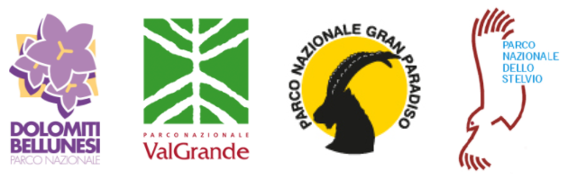

 

## PRESENTAZIONE DEL CORSO
---

### Lezioni
MODULO 1  
[**Lezione 1.**](https://github.com/feurbano/corsoparchi/blob/master/lezioni/lezione_01.md) Introduzione alla gestione dei dati - [<ins>[**Link pagina web**](https://feurbano.github.io/corsoparchi/lezioni/lezione_01.html)</ins>] [<ins>[**Link presentazione**](https://docs.google.com/presentation/d/1XyWKH8GZxVzKnz5JL4B-3uMMULKOEaAzruW7Ps_FQeI/edit?usp=sharing)</ins>]  
[**Lezione 2.**](https://github.com/feurbano/corsoparchi/blob/master/lezioni/lezione_02.md) Introduzione ai database - [<ins>[**Link pagina web**](https://feurbano.github.io/corsoparchi/lezioni/lezione_02.html)</ins>] [<ins>[**Link presentazione**](https://docs.google.com/presentation/d/1c5SVeZIgyzI1XVzP-DYiVm4xGygObjy3FZR4bRpEIQY/edit?usp=sharing)</ins>]  
[**Lezione 3.**](https://github.com/feurbano/corsoparchi/blob/master/lezioni/lezione_03.md) Gestire e usare un database - [<ins>[**Link pagina web**](https://feurbano.github.io/corsoparchi/lezioni/lezione_03.html)</ins>]
MODULO 2  
[**Lezione 4.**](https://github.com/feurbano/corsoparchi/blob/master/lezioni/lezione_04.md) Comandi SQL base per interrogare i dati  
[**Lezione 5.**](https://github.com/feurbano/corsoparchi/blob/master/lezioni/lezione_05.md) Organizzazione dei dati del Progetto Biodiversità    
MODULO 3  
[**Lezione 6.**](https://github.com/feurbano/corsoparchi/blob/master/lezioni/lezione_06.md) Comandi SQL per unire dati da tabelle diverse  
[**Lezione 7.**](https://github.com/feurbano/corsoparchi/blob/master/lezioni/lezione_07.md) Dati spaziali  
MODULO 4  
[**Lezione 8.**](https://github.com/feurbano/corsoparchi/blob/master/lezioni/lezione_8.md) Comandi SQL avanzati  
[**Lezione 9.**](https://github.com/feurbano/corsoparchi/blob/master/lezioni/lezione_9.md) Inserimento di nuovi dati  
[**Lezione 10.**](https://github.com/feurbano/corsoparchi/blob/master/lezioni/lezione_10.md) Manutenzione del database  

### Docente
Ferdinando Urbano

### Date
  * Lunedì  22/3/2021 09:00-13:00 (Modulo 1)
  * Martedì 23/3/2021 09:00-13:00 (Modulo 2)
  * Lunedì  29/3/2021 09:00-13:00 (Modulo 3)
  * Martedì 30/3/2021 09:00-13:00 (Modulo 4)

### Piattaforma di videoconferenza
Da definire  

### Obiettivi e utenti
L'obiettivo generale del corso è rendere i Parchi il più possibile autonomi nella gestione e aggiornamento dei propri database e favorirne l'ulteriore sviluppo. In particolare:
  * per i **coordinatori scientifici** l'obiettivo è comprendere come i database sono strutturati e come funzionano per poter coordinare il loro sviluppo e potere usare i dati nel database in modo basico;
  * per i **tecnici** l'obiettivo è approfondire come i dati possono essere manipolati e utilizzati in modo avanzato una volta inseriti nel database;
  * per i **collaboratori** l'obiettivo è conoscere le problematiche legate alla raccolta dei dati in relazione al loro inserimento nel database e all'utilizzo dei dati contenuti nel database in fase di analisi e reportistica;
  * per gli **esperti informatici** l'obiettivo è acquisire le competenze base per integrare il database nel sistema informativo del Parco e gestire la componente software e hardware;
  * per i futuri **curatori dei dati** l'obiettivo è saper gestire il processo di controllo dei dati e caricamento dei dati nel database e cominciare a capire come estende il database con nuovi set id dati.
  Per tutti i gruppi un obiettivo ulteriore è approfondire le problematiche generali legate alla gestione dei dati e le possibili soluzioni tecniche.

### Utenti
Coordinatori tecnici, tecnici faunistici, esperti informatici e potenziali curatori dei dati dei Parchi; consulenti e collaboratori dei Parchi per la raccolta e la gestione dei dati.  

### Motivo del corso
Tutti i 4 Parchi Nazionali Alpini Italiani (Parco Nazionale del Grand Paradiso, Parco dello Stelvio, Parco Nazionale della Val Grande, Parco Nazionale delle Dolomiti Bellunesi) hanno deciso di gestire ed archiviare i dati raccolti nell'ambito del progetto Biodiversità in database (su piattaforma PostgreSQL) armonizzati fra loro. Allo stesso tempo, i Parchi hanno cominciato a controllare, formalizzare, documentare, armonizzare ed inserire nel proprio database centralizzato anche altri dataset sulla fauna (raccolti nel passato o tuttora in corso). In questo processo sono stati accompagnati da un consulente esterno che ha creato i database, definito il modello dei dati, sviluppato le procedure di controllo e verifica dei dati e definito i protocolli per l'aggiornamento dei dataset esistenti. Finita questa fase preliminare, i Parchi hanno la necessità di acquisire più autonomia nell'uso, aggiornamento e gestione dei propri database per garantirne la continuità e l'uso e per questo motivo hanno fato richiesta di un training specifico.  

### Struttura del corso e risultati attesi
Il corso è strutturato in 4 moduli con obiettivi distinti, suddivisi in 10 lezioni, in modo da permettere ai partecipanti di scegliere a quali moduli partecipare in base ai loro interessi e livelli pregressi di conoscenza dei database. Prima di passare a un modulo successivo, si cercherà di consolidare le conoscenze acquisite nel modulo precedente, in caso riducendo il tempo per i moduli avanzati. Alla fine del corso il personale dei Parchi e i loro collaboratori sapranno utilizzare e aggiornare il proprio database e coordinarne tramite eventuali collaboratori esterni.
* **Modulo 1**: *Introduzione alla gestione dei dati e database*. Questo modulo da ai partecipanti nozioni di base di gestione dei dati, spiega cosa è e come è fatto un database relazionale, mostra come collegarsi ai database dei Parchi con vari strumenti, visualizzare una tabella e scaricare i dati in formato csv o shapefile.
* **Modulo 2**: *Introduzione a SQL*. Questo modulo spiega come interagire in modo semplice con i database tramite comandi SQL di base, come modificare i dati nelle tabelle e come scaricare i dati formattandoli a piacere.
* **Modulo 3**: *Comandi SQL per interagire con il database in modo complesso*. Questo modulo insegna ad interagire con i dati in modo avanzato con comandi SQL più complessi in modo da poter combinare dati di diverse tabelle ed analizzare i dati in modo strutturato.
* **Modulo 4**: *Gestione e aggiornamento del database*. Questo modulo spiega come creare nuovi oggetti nel database, processare e verificare nuovi dati raccolti sul campo e inserirli nel database.

### Materiale
Il materiale del corso (presentazioni, lezioni, esercizi) è disponibile in questo sito. Nelle 4 mezze giornate di corso il materiale verrà presentato e spiegato, rimanendo poi a disposizione di tutti per approfondirne lo studio. Se possibile, le lezioni online verranno registrate e condivise. Ulteriore materiale di approfondimento sui database, PostgreSQL e la gestione dei dati può facilmente essere reperito online (libri, tutorial, corsi sia gratuiti sia a pagamento).  

### Requisiti
Conoscenze di base degli strumenti informatici, familiarità con fogli di calcolo e con dataset ecologici. Per svolgere gli esercizi è necessario un computer con connessione a Internet, la possibilità di installare PgAdmin4 e accesso al Database Biodiversità condiviso dei Parchi o al database del proprio Parco.  
