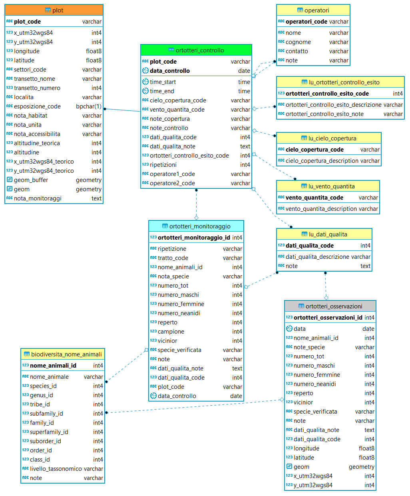
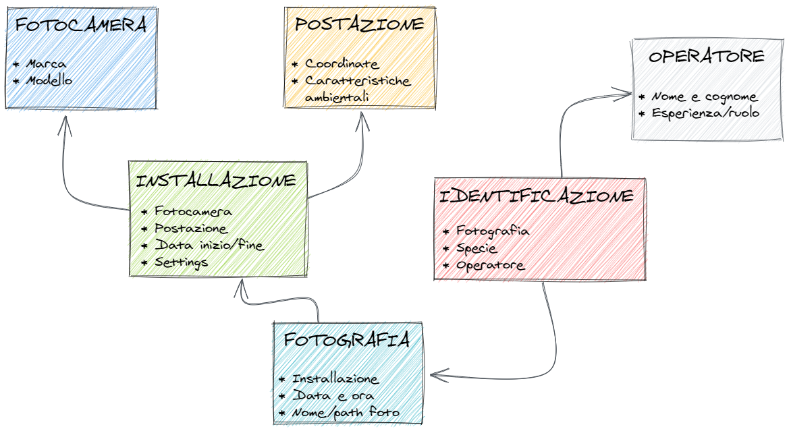

 

#### Lezione 2
## INTRODUZIONE AI DATABASE

Autore: Ferdinando Urbano  

---
Materiale in formato [<ins>[**PRESENTAZIONE**](https://docs.google.com/presentation/d/1c5SVeZIgyzI1XVzP-DYiVm4xGygObjy3FZR4bRpEIQY/edit?usp=sharing)</ins>]  

Lezione in formato [<ins>[**PDF**](https://github.com/feurbano/corsoparchi/blob/main/lezioni/materiale/l02_presentazione.pdf)</ins>]  

### SOMMARIO  
* Cos'è un database relazionale  
* Principali oggetti di un database  
* Vincoli formalizzati  
* Modello dati  
* Il linguaggio dei database  

### Database relazionali
In informatica, con base di dati, banca dati, database o anche DB, si indica un insieme di dati organizzati in modo da facilitarne la gestione, l'uso e l'aggiornamento, memorizzati in un computer.  
Il modello relazionale è un modello logico di strutturazione dei dati di un database. Tutti i dati sono rappresentati come relazioni (tabelle) collegate fra loro.  
I dati vengono manipolati con gli operatori dell'algebra relazionale attraverso il linguaggio SQL.  
PostgreSQL è un sistema avanzato di gestione di basi di dati relazionali (Database Management System, DBMS) orientato a oggetti. PostgreSQL è un software open source.  

L'uso dei database per gestire i dati implica uno sforzo considerevole per chi non ha già familiarità con questi strumenti, ma questo è necessario per essere in grado di gestire set di dati grandi e/o complessi in un contesto multi-utente dove i dati dovrebbero essere riutilizzati per diversi progetti, minimizzando allo stesso tempo la possibilità che i dati siano affetti da errori.  
Il tempo speso per imparare a  utilizzare database sarà ripagato poi con il tempo risparmiato per la gestione e l'elaborazione dei dati rispetto ad approcci di gestione dei dati più semplici (ad esempio, fogli elettronici) e la qualità e possibilità di riutilizzare i dati in futuro.   Esistono anche altri sistemi avanzati di gestione dei dati (es. database NoSQL), ma al momento nella maggior parte dei casi i database relazionali rimangono la soluzione migliore per la gestione dei dati in ecologia.

### Punti di forza di PostgreSQL  
* Ottima qualità  
* Velocità di sviluppo  
* Ottimo supporto della comunità  
* Possibilità di supporto professionale  
* Documentazione  
* Ottima estensione per i dati spaziali  
* Progetto stabile e di lungo periodo  
* Utilizzato da grandi compagnie  
* Multi-piattaforma  
* Stabilità e Sicurezza  
* Funzionalità native mature e stabili  
* Implementazione di funzionalità avanzate  
* Molti linguaggi procedurali  

### Vantaggi dell'open source  
* Non ci sono costi associati alle licenze  
* Non ci sono limitazioni all’uso  
* Non ci sono politiche vendor-lock  
* Si integra perfettamente con altri strumenti open source  
* Implementazione di standard aperti  
* Ottima interoperabilità  
* Comunità molto attiva  
* Possibilità di richiedere funzionalità specifiche  
* Filosofia coerente con principi della ricerca e della conservazione  

### Architettura Server-Client  
Client-server è l'architettura di una applicazione divisa in due componenti distinte: un programma "server" che fornisce un servizio ed un programma "cliente" che accede al servizio.  
Il client è di solito una interfaccia attraverso cui un utente fa una richiesta al server. Il client converte poi la risposta del server nella forma richiesta dall'utilizzatore.  
PostgreSQL è il server, e riceve le richieste tramite comandi SQL dai client. Alcuni esempi di possibili client sono PgAdmin, QGIS, R, Calc, Excel, interface web, Access, ArcGIS.  
I dati vengono visualizzati dai client ma sono archiviati solo nel DB. Ogni utente ha la possibilità a di usare il tool di interazione con il database che preferisce.  
Il database server è il sistema back-end di un'applicazione di database che utilizza l'architettura client/server (fornisce le funzionalità di database alle applicazioni client).  
Un database server è installato su un computer fisico (server), o in servizi nel cloud (ad esempio, AWS).  
Su uno stesso server fisico possono essere installati più database server. All'interno dello stesso database server possono essere creati diversi database.  
Gli utenti sono creati a livello di database server, ma i permessi sono assegnati per i singoli oggetti di ogni database.  
Per accedere ad un DB bisogna conoscere l’indirizzo IP del server, la porta e il nome del database (ed avere un utente abilitato).  

### PgAdmin  
PgAdmin è uno dei (molti) possibili client e la principale interfaccia per la gestione dei database di PostgreSQL.  
L'applicazione è indirizzata sia agli amministratori del database, sia agli utenti principianti ed esperti.  
Permette tramite interfaccia grafica di visualizzare le tabelle, interrogare e scaricare i dati tramite il linguaggio SQL, creare oggetti del database, gestire gli utenti, fare backup.  
Può essere eseguito sia come applicazione web che desktop. È open source e si può scaricare dal sito: https://www.pgadmin.org/.  
È possibile utilizzare i dati anche usando altri client, ma questo è probabilmente il migliore per la gestione del DB.  

### PostGIS  
PostGIS è un'estensione (opensource) di PostgreSQL che permette di includere tutti i dati spaziali (punti, linee, poligoni e raster) come fossero normali attributi di un oggetto.  
PostGIS estende il linguaggio SQL con tutti i comandi tipici dei sistemi GIS. I dati possono poi essere visualizzati in un qualsiasi desktop GIS (ad esempio, QGIS e ArcGIS).  
Usando un database spaziale (PostgreSQL + PostGIS) i dati spaziali non devono essere gestiti in un formato specifico (ad esempio, ESRI Shapefile), ma sono perfettamente integrati con tutte le altre informazioni, sia per l’archiviazione, sia per l’analisi.  

### Schemi    
Schemi: Un database contiene uno o più schemi, che a loro volta contengono tabelle e altri tipi di oggetti come le viste, le sequenze e le funzioni. Un oggetto con lo stesso nome può essere usato in schemi diversi ma non nello stesso schema.  
Gli schemi sono analoghi alle cartelle di un file system, eccetto che gli schemi non possono essere annidati.  
Gli schemi vengono usati per:  
* organizzare gli oggetti del database in gruppi logici per renderli più gestibili;  
* permettere a molti utenti di usare un database senza interferire l'uno con l'altro;  
* applicazioni di terze parti possono essere messe in schemi separati in modo che non collidano con i nomi di altri oggetti.  

### Tabelle    
Tabelle: Nei database relazionali i dati sono organizzati in tabelle relazionate fra di loro. Una tabella è strutturata in righe e colonne che formano una griglia. Il numero di colonne è definito a priori, mentre ci può essere un qualsiasi numero di righe.  
In generale, ogni tabella rappresenta un tipo di oggetto del mondo reale (ad esempio un plot, una trappola, un individuo catturato). Gli attributi di quell'oggetto solo le colonne, mentre una riga rappresenta un oggetto specifico, chiamato anche entità.  
Le tabelle sono simili ai fogli di lavoro dei fogli di calcolo. Una tabella è diversa da un foglio di calcolo per la presenza di vincoli sugli attributi (tipologia e dominio) e perché non può avere righe uguali. Ogni riga è univocamente identificata dai valori di un sottoinsieme di colonne (chiave primaria).  

### Tipi di dato
In un database, viene definita formalmente a priori la tipologia di valori che ogni colonna (attributo) potrà contenere.  
Ogni colonna deve contenere una singola informazione.  

**Numerici**  
* integer: intero con segno a 4 byte  
* bigint: intero con segno a 8 byte  
* numeric [(p, s)]: numerico di precisione selezionabile  
* double precision: numero a virgola mobile (8 bytes)  
* serial: intero auto incrementale a 4-byte  

**Caratteri**  
* character varying [(n)]: stringa a lunghezza variabile  
* character [(n)]: stringa di caratteri a lunghezza fissa  
* text: stringa di caratteri a lunghezza variabile  

**Data/ora**  
* time without time zone: orario del giorno (senza fuso)  
* time with time zone: orario del giorno, incluso il fuso  
* timestamp without time zone: data e orario (senza fuso)  
* timestamp with time zone: data e orario, incluso il fuso  
* date: data di calendario (anno, mese, giorno)  

**Booleani**  
* boolean: valore Booleano (vero/falso)  

**Dati spaziali**  
* Point, line, polygon (georeferenziati), raster  

**Binari**  
* bytea: dato binario («array di byte»)  

**Altri tipi di dato**  
* Money, xml, URL, ...  

### Ruoli  
PostgreSQL gestisce i permessi di accesso al database attraverso i ruoli. Un ruolo è un'entità che può possedere oggetti e avere privilegi sul database. Può essere un utente individuale o un gruppo di utenti. Si possono raggruppare gli utenti per facilitare la gestione dei privilegi: così i privilegi possono essere concessi a, o revocati da, un gruppo nel suo insieme. Questo viene fatto creando un ruolo che rappresenta il gruppo, e poi concedendo l'appartenenza al ruolo di gruppo ai singoli ruoli utente. I ruoli del database valgono per tutti i database in un cluster, ma i permessi sono poi associati ai singoli oggetti di ogni database. Esempi di permessi sono: lettura, modifica, inserimento, cancellazione. Ad ogni utente assieme al ruolo è assegnata una password per garantire la sicurezza dei dati. Lo stesso accesso al server può essere limitato ad alcuni indirizzi IP. In PostgreSQL i permessi possono arrivare fino al livello di singolo record.  

### Viste  
Le VIEW (o viste) sono una importante funzionalità che consente di vedere in modo semplice i dati nella forma desiderata, combinando varie tabelle e calcolando valori derivati.  
Le esigenze di visualizzazione degli utenti sono così soddisfatte senza condizionare l’organizzazione dei dati all'interno del DB.  
I dati dentro il DB sono strutturati secondo precise regole logiche. Le necessità degli utenti vengono soddisfatte tramite altre funzionalità.  
Una vista è una tabella "virtuale". Per l'utente è una come una tabella, ma nel database è una query SQL (SELECT) che combina e formatta i dati.  
I dati nella vista sono sempre aggiornati in base ai dati contenuti nelle tabelle di origine al momento in cui l'utente ne fa richiesta.  
Le viste semplificano la gestione dei permessi. Ad un utente che non deve modificare i dati, si possono assegnare permessi solo su una vista rendendo la cosa più semplice per l’utente e più sicura per il DB.  

### Sequenze  
Una sequenza è un oggetto che genera una sequenza di valori numerici interi. Ogni volta che viene richiesto un numero, la sequenza incrementa del valore specificato (generalmente 1) in modo da non generare mai due volte lo stesso numero.  
In una tabella si può usare il campo SERIAL che genera in modo automatico una sequenza ed è spesso utilizzato come chiave primaria quando non c'è una chiave primaria naturale.  
Un sequenza non è strettamente legata a una singola tabella. Un campo SERIAL è gestito dal database e non dovrebbero essere inseriti valori da parte degli utenti.  
La sequenza genera numeri, ma non controlla come vengono usati. In un campo SERIAL possono esserci gap se si è provato a inserire dei record senza successo o se dei record sono stati cancellati.  

### Trigger e funzioni  
Il trigger è una procedura che viene eseguita in maniera automatica dal database in coincidenza di un determinato evento, come ad esempio la cancellazione, l'inserimento o la modifica di un record di una tabella. In questo modo si possono specificare e mantenere vincoli di integrità complessi o compilare automaticamente dei campi in base ad altri che sono stati inseriti.  
Una funzione è un codice di programma che viene creato nel DB usando SQL o altri linguaggi (ad esempio PSQL, Python, C, R) per creare processi e algoritmi complessi. Una volta creata, una funzione diventa parte della libreria del database e può essere chiamata all'interno delle query SQL o da un trigger.  
Come utenti del DB non dovete creare funzioni e trigger, ma è utile sapere che esistono perché il vostro database del Parco li usa.  

### Vincoli sui dati  
In un database ci sono molti modi di porre dei vincoli sui dati che possono essere inseriti, in modo da garantire la correttezza delle informazioni. Il database non permetterà l’inserimento di dati che non rispettano queste regole. In particolare:  
* Tipi di dato (as esempio, un numero intero)  
* Valore unico (ad esempio, lo stesso nome non può essere usato per due operatori)  
* Un campo non può assumere valore non nullo (ad esempio la data di un controllo deve essere sempre presente)  
* Un campo può avere valori solo in un certo set o range(ad esempio fra 1 e 10, o nella lista [“Sereno”, “Coperto”])  
* Il valore deve esistere in una tabella collegata (chiamata look up table)  

### Vincoli fra tabelle  
Il modello relazione che lega fra loro le tabelle si realizza concretamente con dei vincoli fra le tabelle chiamate chiavi esterne (foreign keys).  
Una chiave esterna specifica che un valore in una tabella può esistere se e solo se quel valore è presente in una tabella madre.  
Ad esempio, se in una tabella ho la lista dei plot e in un’altra ho la lista delle trappole, non posso creare una trappola se nella tabella plot non esiste il plot corrispondente.  
Le chiavi esterne formalizzano il legami logici fra le tabelle e obbligano a definire un modello dati logico.  
Le chiavi esterne sono un potente strumento per assicurare la coerenza dei dati.  

### Cos’è un modello dati  
Il modello dati è la rappresentazione concettuale del mondo reale nelle strutture di un database relazionale (tabelle e loro relazioni). È la struttura logica centrale di un DB e descrive quali tipi di dati sono immagazzinati e come sono organizzati.  
La definizione del modello dati è necessaria non solo per strutturare coerentemente il database, ma è anche un modo estremamente utile per spingere i responsabili di una raccolta dati a definire formalmente gli oggetti di uno studio e i legami logici e biologici tra i gruppi di dati raccolti.  
La modellazione dei dati è banale nel caso di set di dati semplici, ma è fondamentale quando devono essere gestiti moli di dati grandi e complesse.  
Lo sviluppo di un modello dati e la sua implementazione in un database ha tre fasi iniziali:  
* Il livello concettuale rappresenta concetti e relazioni tra concetti. È completamente indipendente dal database che gestirà le strutture dati.  
* Il livello logico genera un modello dettagliato, guidato dalle relazioni di significato tra i dati (definizione delle tabelle con indicazione di colonne e data type, chiavi primarie, regole di integrità).  
* Il livello fisico definisce le caratteristiche utili per l'ottimizzazione delle prestazioni e della memoria.  

### Esempio di modello dati ER
> "In informatica, nell'ambito della progettazione dei database, il modello entity-relationship è un modello teorico per la rappresentazione concettuale e grafica dei dati a un alto livello di astrazione. Il modello entità-associazione viene spesso utilizzato nella prima fase della progettazione di una base di dati, nella quale è necessario tradurre le informazioni risultanti dall'analisi di un determinato dominio in uno schema concettuale, chiamato schema E-R (schema entità-associazione) o diagramma E-R (diagramma entità-associazione). Il modello E-R si basa su un insieme di concetti molto vicini alla realtà di interesse: quindi facilmente intuibili dai progettisti (e in genere considerati sufficientemente comprensibili e significativi anche per i non-tecnici), ma non implementabili sugli elaboratori."

**Monitoraggio ortotteri**   
Oggetti principali:  
* Plot  
* Controllo (vista al plot)  
* Monitoraggio (determinazioni)  
* Osservazioni (dati occasionali)  

Altri oggetti:  
* Lista nomi specie  
* Operatori  
* Altre look up tables  

### Modello dati: caso studio  
**Monitoraggio con fototrappole**  
Un progetto di monitoraggio prevede l’installazione di fototrappole in varie postazioni fisse. Le fototrappole generano delle immagini che vengono poi analizzare dagli operatori. In ogni immagine può poi essere identificata una o più specie.  

  

### Modello dati: esempio  
Monitoraggio di ungulati con collari GPS  
* Sensori  
* Collari  
* Animali  
* Applicazione del sensore su un animale [definizione formale]  
* Cattura  
* Informazioni sulla fine del monitoraggio e sulla mortalità  

### Normalizzazione  
La normalizzazione è un procedimento per l’eliminazione della ridondanza e del rischio di incoerenza dal DB. Si basa sul criterio che se una relazione presenta più concetti tra loro indipendenti, la si decompone in relazioni più piccole, una per ogni concetto. In sostanza, la stessa informazione non deve essere ripetuta.  
Regole delle prime 3 forme normali:  
* Ogni riga di ciascuna tabella deve poter essere identificata in modo univoco da un gruppo di dati in essa contenuti  
* Ogni colonna fa riferimento a dei dati atomici  
* I campi non chiave dipendono dall’intera chiave primaria e non da una parte di essa  
* I campi non chiave non dipendono da altri campi non chiave  
In un database relazionale, i dati non devono essere organizzati in base a come si vuole visualizzarli. I criteri per la progettazione di un database sono in buona misura indipendente da una specifica applicazione in modo da poter essere utilizzati anche per altri scopi.  
Tabelle riassuntive che riportano i dati come richiesto da un singolo utente o da una specifica applicazioni possono essere create tramite le VISTE, soddisfacendo queste esigenze senza compromettere la struttura logica del modello dati.  

### Il linguaggio SQL  
SQL (Structured Query Language) è il linguaggio di definizione e manipolazione dei dati universalmente usato (e standardizzato) nei database relazionali. Non richiede la stesura di sequenze di operazioni, ma di specificare le proprietà logiche delle informazioni ricercate (linguaggio dichiarativo). Si divide in:  
* Query language (QL) - interrogare i dati nel database  
* Data Definition Language (DDL) - creare, cancellare, modificare database  
* Data Manipulation Language (DML) - inserire, cancellare, modificare i dati  
* Data Control Language (DCL) - gestire gli utenti e i permessi  
* Device Media Control Language (DMCL) - controllare i supporti dove vengono memorizzati i dati  

#### FINE DELLE PRESENTAZIONI TEORICHE  
#### ORA ESERCITAZIONI PRATICHE!!  

---
[**Lezione 3.**](https://github.com/feurbano/corsoparchi/blob/master/lezioni/lezione_03.md) Usare e gestire un database - [<ins>[**Link pagina web**](https://feurbano.github.io/corsoparchi/lezioni/lezione_03.html)</ins>]
