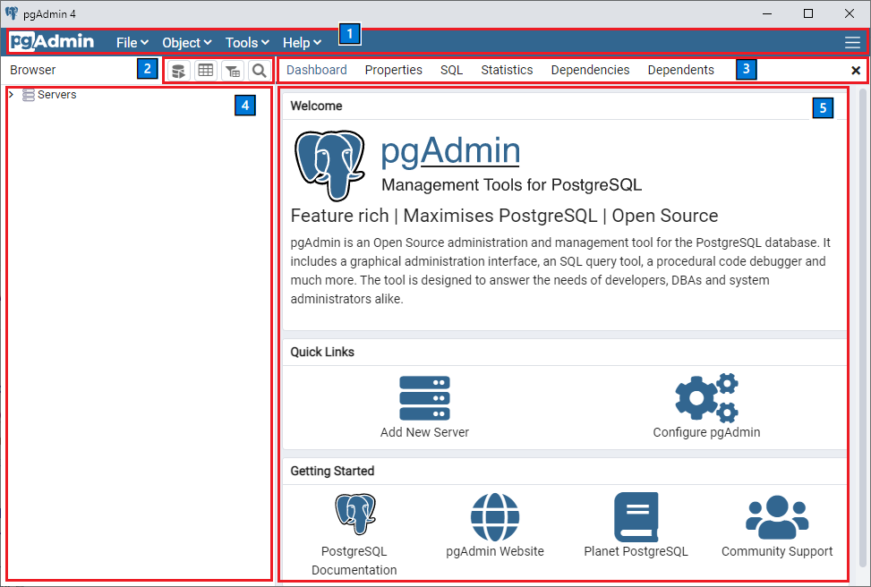
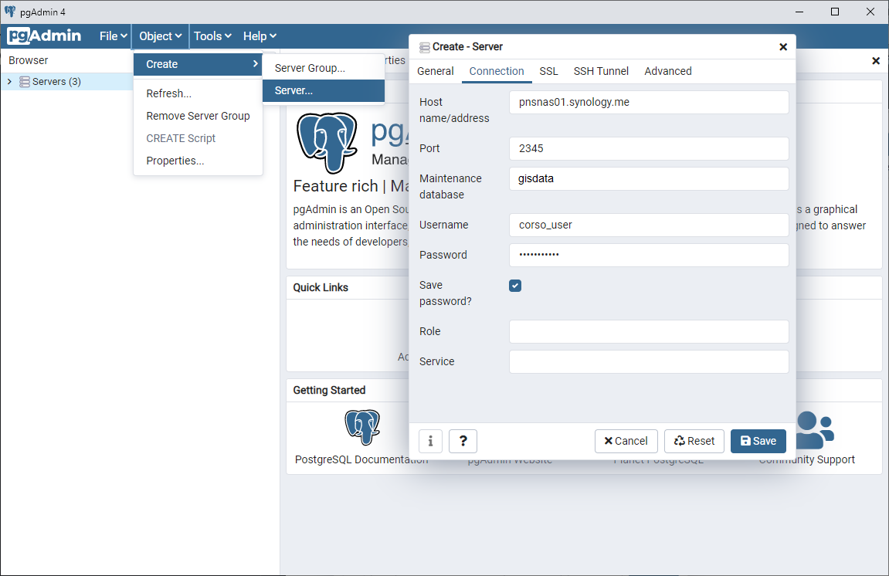

 

# WORK IN PROGRESS

#### Lezione 3
## USARE E GESTIRE UN DATABASE
---
### Installare PgAdmin
Per interagire con un database PostgreSQL non è necessario installare PostgreSQL, ma è sufficiente installare un client che si collega al database (server). Il database con i dati è invece fisicamente installato su un server del Parco (o nel cloud). Installare PostgreSQL sul proprio computer è necessario solo per creare un nuovo database in locale per farsi il proprio database personale.

PgAdmin è la più comune interfaccia grafica per l'interrogazione dei dati e la gestione di PostgreSQL. È possibile visualizzare le tabelle, interrogare e scaricare i dati, creare nuove tabelle e view, modificare e inserire dati, gestire gli utenti, fare backup.  
Le versioni fino alla PgAdmin4 v4.50 sono basate su browser (il tool viene aperto in Google Chrome, Firefox, Safari o altro). Dalla versione PgAdmin4 v5.0 il tool è invece stand alone (si apre come programma a se). Le due versioni sono comunque equivalenti.  
PgAdmin è un software open source e ha aggiornamenti molto frequenti. Se si installa PostgreSQL, PgAdmin4 viene installato automaticamente.  
PgAdmin non è l'unico client che si può usare per manipolare i dati e gli oggetti nel database. Alcuni tool per finalità specifiche sono presentati in  seguito. Una alternativa a PgAdmin4 per la gestione del database è ad esempio dBeaver ([https://dbeaver.io/download/](https://dbeaver.io/download/), versione Community), molto utile anche per generare i diagrammi ER (è il tool utilizzato per creare le immagini riportate in queste pagine).  

Si può scaricare PgAdmin4 da qui:  
[<ins>[**Link pagina web**](https://feurbano.github.io/corsoparchi/lezioni/lezione_03.html)</ins>]

* <ins>[**Download PgAdmin for WINDOWS**](https://www.pgadmin.org/download/pgadmin-4-windows/)</ins>  
* <ins>[**Download PgAdmin for MAC**](https://www.pgadmin.org/download/pgadmin-4-macos/)</ins>  
Versione consigliata: PgAdmin4 v5.0 (anche versioni precedenti vanno bene).

Quando viene aperto la prima volta, PgAdmin chiede di creare una password. Questa non è la password di accesso ai database, ma solo la password di accesso a PgAdmin (visto che poi PgAdmin salva al suo interno tutte le password di accesso ai database). Potete mettere qualsiasi password facile da ricordare (ad esempio 'postgres').

### Struttura di PgAdmin

L'interfaccia di PgAdmin è organizzata in 5 sezioni principali (vedi immagine). La visualizzazione degli elementi può essere ottimizzata attraverso le opzioni di personalizzazione.  

  

Le 5 sezioni (o pannelli) sono:
1. La barra dei menù
2. La barra degli strumenti
3. La barra delle schede (tab)
4. Il menù ad albero con gli oggetti del database
5. Contenuto della scheda selezionata (proprietà di un oggetto, tabelle, editor SQL)

Ogni parte è utilizzata per eseguire diversi tipi di attività di gestione. L'esempio di operazione più comune è la selezione di un oggetto del database nel menù ad albero del pannello 4 (ad esempio, una tabella) e la sua visualizzazione nel pannello 5 (contenuto della scheda). I pulsanti *Help* nell'angolo in basso a sinistra di ogni finestra di dialogo aprono la guida in linea per la finestra stessa. Si può accedere ad informazioni aggiuntive navigando attraverso il menu Help.  

### Descrizione dei pannelli

#### PANNELLO 1. La barra dei menù
La barra dei menu di pgAdmin fornisce menu a tendina per l'accesso a opzioni, comandi e utilità. La barra dei menu mostra le seguenti selezioni: *File*, *Object*, *Tools* e *Help*. Le selezioni possono essere grigie, il che indica che sono disabilitate per l'oggetto attualmente selezionato nel menù ad albero (pannello 4). A molte di queste opzioni si può accedere anche selezionando un oggetto del database e cliccando sul pulsante destro.   
Si possono utilizzare le opzioni della finestra di dialogo Preferenze (*File/Preferences*) per personalizzare l'interfaccia di PgAdmin. Il pannello a sinistra della finestra Preferenze mostra un menù ad albero: ogni nodo del controllo ad albero fornisce l'accesso alle opzioni che sono relative al nodo sotto il quale sono visualizzate. Le opzioni più utili da modificare sono *Browser/nodes* e *Browser/Tab settings*. In Nodi si possono selezionare gli oggetti del database che vengono visualizzati nel menù ad albero (pannello 4). La maggior parte degli oggetti non ha nessun interesse per l'utente di base e posso essere nascosti, rendendo l'esplorazione del database più immeditata. Gli oggetti (nodi) da tenere sono (gli altri, se volete potete nasconderli):  
* Check Constraints  
* Columns  
* Constraints  
* Extensions  
* Foreign Keys  
* Functions  
* Indexes  
* Login/Group Roles  
* Primary Key  
* Rules  
* Schemas  
* Sequences  
* Tables  
* Triggers  
* Trigger Functions  
* Unique Constraint  
* Views  

In Tab Settings, è consigliato settare com *Query tool tab title* = %DATABASE% e come *View/Edit data tab title* = %DATABASE%/%USERNAME%. Visto che tutti gli oggetti che vengono aperti sono aggiunti al pannello 3 come tab aggiuntive, questi parametri rendono più breve il titolo del tab e quindi più piccolo il singolo tab, facilitando la selezione del tab corretto quando sono aperti molti tab (ad esempio, molte tabelle o molte finestre di inserimento di codice SQL). Con l'opzione *Open in new browser tab* si può scegliere di aprire nuovi oggetti come finestre separate invece che come tab aggiuntivi. In ogni caso tutte queste modifiche sono opzionali e potete lasciare i parametri di default.

In *Query tool* si potranno invece modificare in seguito i parametri di default per la visualizzazione del codice SQL (utile le prossime lezioni) e per l'esportazione delle tabelle (ad esempio, se i campi vengono separati da virgole o punti e virgola)
Usa i campi del pannello Nodi per selezionare i tipi di oggetti che verranno visualizzati nel controllo ad albero Browser:
Il pannello visualizza un elenco di oggetti del database; fai scorrere l'interruttore situato accanto a ciascun oggetto per mostrare o nascondere l'oggetto del database. Quando si interrogano i cataloghi di sistema, è possibile ridurre il numero di tipi di oggetti visualizzati per aumentare la velocità.

#### PANNELLO 2. La barra degli strumenti
La barra degli strumenti mostra i pulsanti di scelta rapida per le funzioni utilizzate più di frequente come aprire una tabella o aprire una nuova finestra per fare delle interrogazioni in SQL.  I pulsanti vengono abilitati/disabilitati in base al nodo del browser selezionato.
Barra degli strumenti pgAdmin
    Usare il pulsante Query Tool per aprire il Query Tool nel contesto del database corrente.
    Usa il pulsante Visualizza dati per visualizzare/modificare i dati memorizzati in una tabella selezionata.
    Usate il pulsante Righe filtrate per accedere al popup Filtro dati per applicare un filtro a un insieme di dati da visualizzare/modificare.
    Usa il pulsante Cerca oggetti per accedere alla finestra di dialogo degli oggetti di ricerca. Ti aiuta a cercare qualsiasi oggetto del database.

#### PANNELLO 3. La barra delle schede
Nella barra delle schede, si trovano tutti gli oggetti selezionati, in particolare tabelle e finestre per interrogazioni SQL. Si può aprire un numero indefinito di tab, anche se la navigazione può diventare complicata con molte schede aperte. Selezionando una scheda (tab) si visualizza in suo contenuto nel pannello sottostante (5).  
Di default vengono visualizzate 5 schede:
* La scheda Dashboard mostra le statistiche di utilizzo del server e dei database.
* La scheda Properties visualizza le informazioni sull'oggetto selezionato.
* La scheda SQL visualizza lo script SQL che ha creato l'oggetto evidenziato e, quando applicabile, un'istruzione SQL (commentata) che elimina l'oggetto selezionato. Si possono copiare le istruzioni SQL facendo copia/incolla, operazione spesso molto utile per chi deve creare nuovi oggetti del database.
* La scheda Statistics visualizza le statistiche tecniche relative all'oggetto selezionato. In questa scheda non è possibile inserire dei comandi SQL, che vanno invece inseriti nell'apposito editor che viene aperto in un tab separato.
* La scheda Dependencies visualizza gli oggetti da cui dipende l'oggetto attualmente selezionato.
* La scheda Dependents visualizza una tabella di oggetti che dipendono dall'oggetto attualmente selezionato nel browser pgAdmin.  

Usa l'icona di chiusura (X) situata nell'angolo superiore destro di ogni scheda per chiudere la scheda. Si consiglia di chiudere tutte le schede di default ad eccezione di SQL e Properties. Altre schede si aprono quando vengono aperti altri oggetti(come una tabella o l'editor SQL). Una volta che non sono più necessarie, anche queste schede possono essere rimosse con icona di chiusura (X).  

#### PANNELLO 4. Il menù ad albero  
Il menù ad albero, simile al menù di un file system, fornisce una panoramica dei database e dei loro oggetti che risiedono su un server. Fai clic con il tasto destro del mouse su un nodo all'interno del controllo ad albero per accedere ale sue proprietà. Con un click ogni nodo viene espanso e mostra gli oggetti contenuti al suo interno (ad esempio, le colonne di una tabella). Nel tab SQL è visibile il codice SQL che genera quell'oggetto.  

#### PANNELLO 5. Contenuto delle schede
In questo pannello viene visualizzato il contenuto nel tab selezionato nel pannello 3. Il contenuto varia a seconda dell'oggetto selezionato (ad esempio, la lista delle proprietà di un oggetto, i dati di una tabella, un editor per scrivere una interrogazione SQL).  

### Collegarsi a un server
I database con i dati dei Parchi sono fisicamente installati su dei server istituzionali e sono accessibile da ovunque, sia dentro sia fuori la rete interna dei Parco, una volta che si hanno le credenziali (utente e password). I database funziona come un server centralizzato che invia i dati quando richiesto dalle applicazioni client, che li mostrano poi all'utente nella forma desiderata. Un client è un software che accede ad un servizio remoto (il database) installato su un altro computer (il server), tramite una rete (Internet). Il client può essere installato su un qualsiasi computer/device e il database può gestire più connessioni contemporaneamente (il database può essere usato allo stesso momento da più utenti senza rischio di corrompere i dati). In generale, praticamente tutti i software per la gestione, visualizzazione e analisi dei dati si possono interfacciare con un database PostgreSQL.

Per collegarsi al database, qualunque sia il client utilizzato sono in generale necessari 5 parametri:

1. Indirizzo IP del server  
2. Porta  
3. Nome utente
4. Password utente
5. Nome del database

Il nome utente e la password possono essere creati dal gestore del database. Nelle sezioni seguenti verrà illustrato in modo sintetico come collegarsi a un database con i client più comunemente usati. Per illustrare gli esempi discussi in queste lezioni e per poter fare pratica, il Parco del Gran Paradiso ha gentilmente offerto la sua infrastruttura per ospitare un database "di lavoro" dove sono stati caricati alcuni dati del progetto Biodiversità relativi ai 4 Parchi. Sullo stesso server sono presenti altri database del Parco che non sono però accessibile dall'utente create appositamente per questo corso. I parametri di connessione sono i seguenti:
* Indirizzo IP: db.parco.gran-paradiso.g3wsuite.it  
* Porta: 2345  
* Nome database: corsoparchi  
* Utente: corso_user
* Password: LA PASSWORD SARÀ COMUNICATA DURANTE LE LEZIONI

Per creare una connessione al database di test del corso con PgAdmin  bisogna selezionare dal menù *Object/Create/Server* (oppure cliccare con il pulsante destro sull'icona Server nel pannello con il menu ad albero e selezionare *Create/Server*). Si apre una finestra in cui vanno inseriti i parametri di connessione elencati sopra. Nella scheda *General* va solo inserito un nome (qualsiasi) da dare alla connessione, ad esempio 'database corso'. Nella scheda *Connection* vanno inseriti indirizzo IP del server, nome del database, porta, utente e password (vedi figura sotto). Per non dover inserire la password a ogni nuova connessione, attivare l'opzione *Save password*.
  

Una volta salvata, la connessione apparirà nel menù ad albero espandendo l'icona *Server*.

### Oggetti del database
Descrizione dei principali elementi visualizzati all'interno di un database (server, database, schema, tabelle)  
#### Schema  
#### Tabelle  
#### Campi  
#### Vincoli  
#### Viste
#### Sequenze
#### Utenti e gruppi di utenti  
PostgreSQL offre la possibilità di decidere le operazioni che i vari utenti possono fare sugli oggetti del database (in particolare, le tabelle) attraverso un sistema di permessi. Esempi di permessi sono la sola lettura (non è possibile inserire nuovi dati o modificare e cancellare dati esistenti), oppure lettura e scrittura (compresa modifica e cancellazione dei record esistenti), o ancora la possibilità di creare nuove tabelle o eliminare tabelle esistenti.

  Al momento ci sono 3 livelli di utenza:

      Amministratore del database
      (possibilità di modificare, creare o eliminare ogni oggetto del database, ed assegnare i permessi alle tabelle)
      Curatore di ogni dataset
      (possibilità di leggere e modificare le tabelle di uno specifico dataset ma nessun accesso alle tabelle degli altri dataset)
      Lettore
      (possibilità di leggere tutte le tabelle del database)

  Per ogni livello esiste un "gruppo" a cui vengono associati i singoli utenti. Ogni operatore del Parco che usa il database ha la sua utenza specifica con associata password. Questa utenza è associata a uno o più dei tre gruppi da cui eredita i relativi permessi. In questo modo i permessi di accesso alle tabelle vengono associati ai 3 gruppi e non devono essere riassegnati ogni volta che viene creato un nuovo utente (ad esempio, un nuovo collaboratore del parco).
  Gli operatori del parco possono ottenere un nome utente e una password contattando l'amministrazione del sistema.

  PostgreSQL offre la possibilità di decidere le operazioni che i vari utenti possono fare sugli oggetti del database (in particolare, le tabelle) attraverso un sistema di permessi. Esempi di permessi sono la sola lettura (non è possibile inserire nuovi dati o modificare e cancellare dati esistenti), oppure lettura e scrittura (compresa modifica e cancellazione dei record esistenti), o ancora la possibilità di creare nuove tabelle o eliminare tabelle esistenti.

  Al momento ci sono 3 livelli di utenza:

      Amministratore del database
      (possibilità di modificare, creare o eliminare ogni oggetto del database, ed assegnare i permessi alle tabelle)
      Editor del database
      (possibilità di leggere e modificare i dati di tutte le tabelle ma non di creare/cancella/modificare oggetti del database)
      Lettore
      (possibilità di leggere i dati di tutte le tabelle del database)

  Per ogni livello esiste un "gruppo" a cui vengono associati i singoli utenti. Ogni soggetto che usa il database ha la sua utenza specifica con associata password. Questa utenza è associata a uno o più dei tre gruppi da cui eredita i relativi permessi. In questo modo i permessi di accesso alle tabelle vengono associati ai 3 gruppi e non devono essere riassegnati ogni volta che viene creato un nuovo utente (ad esempio, un nuovo collaboratore del parco).
  I soggetti interessati (e autorizzati) possono ottenere un nome utente e una password contattando l'amministrazione del sistema.
  In futuro potranno essere create ulteriori tipologie di utenza per dati o per gruppi specifici.

### Interagire con una tabella
  visualizzare tabella
  modificare un valore
  cancellare un valore
  selezionare i dati
  esportare i dati
  visualizzare i dati spaziali
  visualizzare ed esportare una view
  creare una tabella con interfaccia grafica

### Collegarsi al DB con altri tool
 Esempi di applicazioni client sono pgAdmin (per la gestione del database, per interagire con le tabelle e per interrogare i dati), QGIS e volendo anche ArcGIS (per visualizzare i dati spaziali), R (per analisi statistiche), fogli di calcolo come Calc di Libreoffice o anche Excel (per visualizzare ma non modificare i dati delle tabelle). Un altro client interessante è DBeaver (per interrogare i dati e per creare degli schemi con il modello dati come quelli riportati in questo documento).

#### Collegarsi al database con QGIS
#### Collegarsi al database con R
#### Collegarsi al database con Libre Office

### Esercizio riassuntivo

---
[**Lezione 4.**](https://github.com/feurbano/corsoparchi/blob/master/lezioni/lezione_04.md) Comandi SQL base - [<ins>[**Link pagina web**](https://feurbano.github.io/corsoparchi/lezioni/lezione_04.html)</ins>]
