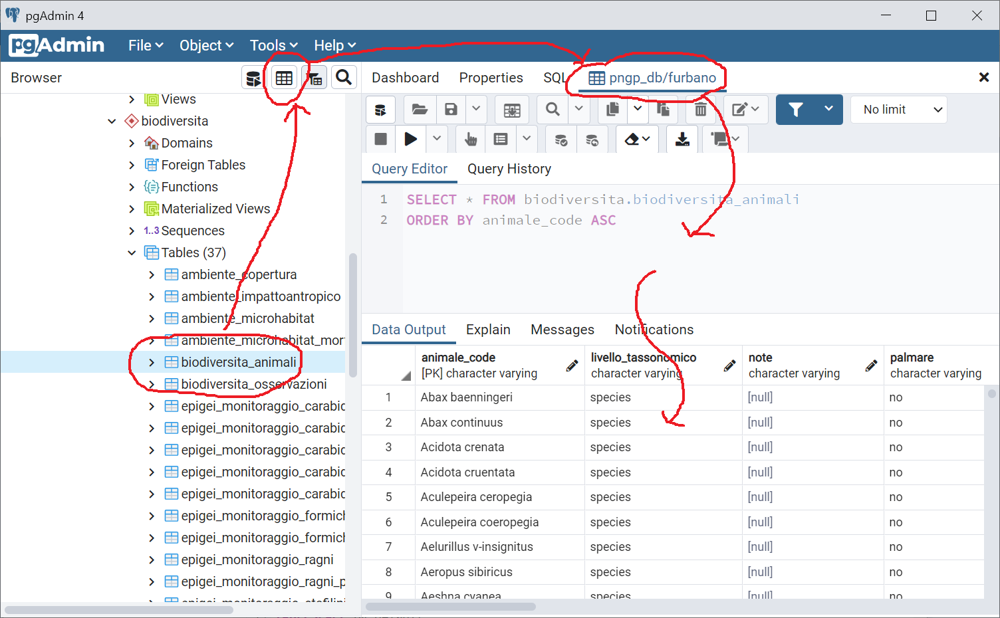
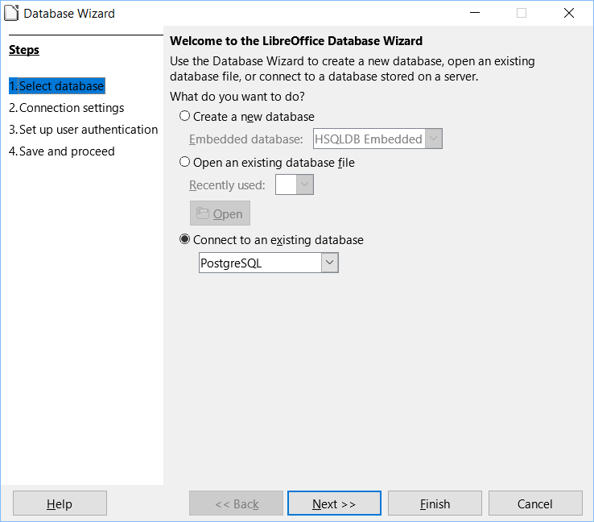
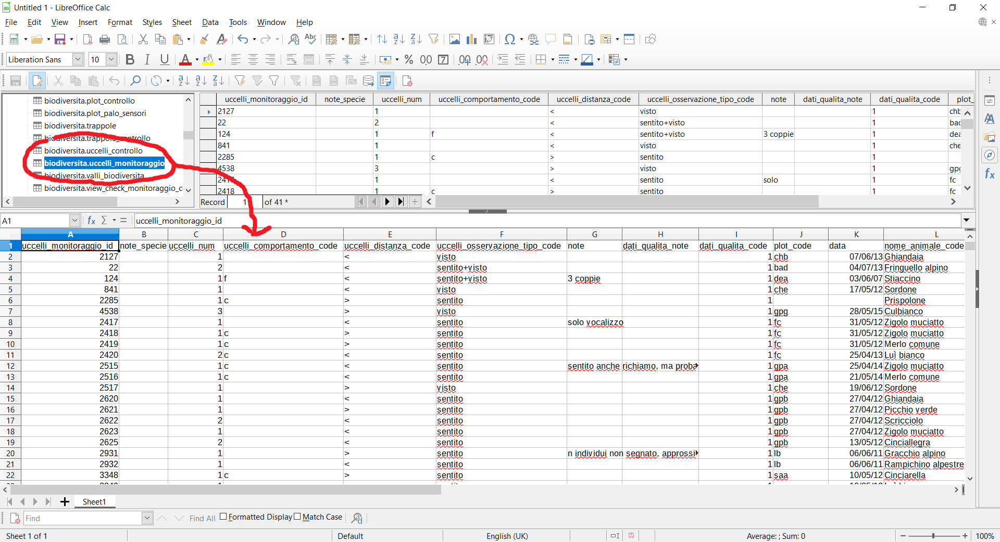

<p align="center"> </p>

#### Lezione 3
## USARE E GESTIRE UN DATABASE
---
### Installare PgAdmin
Per interagire con un database PostgreSQL non è necessario installare PostgreSQL, ma è sufficiente installare un client che si collega al database (server). Il database con i dati è invece fisicamente installato su un server del Parco (o nel cloud). Installare PostgreSQL sul proprio computer è necessario solo per creare un nuovo database in locale per farsi il proprio database personale.  
PgAdmin è la più comune interfaccia grafica per l'interrogazione dei dati e la gestione di PostgreSQL. È possibile visualizzare le tabelle, interrogare e scaricare i dati, creare nuove tabelle e view, modificare e inserire dati, gestire gli utenti, fare backup.  
Le versioni fino alla PgAdmin4 v4.50 sono basate su browser (il tool viene aperto in Google Chrome, Firefox, Safari o altro). Dalla versione PgAdmin4 v5.0 il tool è invece stand alone (si apre come programma a se). Le due versioni sono comunque equivalenti.  
PgAdmin è un software open source e ha aggiornamenti molto frequenti. Se si installa PostgreSQL, PgAdmin4 viene installato automaticamente.  
PgAdmin non è l'unico client che si può usare per manipolare i dati e gli oggetti nel database. Alcuni tool per finalità specifiche sono presentati in  seguito. Una alternativa a PgAdmin4 per la gestione del database è ad esempio dBeaver ([https://dbeaver.io/download/](https://dbeaver.io/download/), versione Community), molto utile anche per generare i diagrammi ER (è il tool utilizzato per creare le immagini riportate in queste pagine).  

Si può scaricare PgAdmin4 da qui:

* <ins>[**Download PgAdmin for WINDOWS**](https://www.pgadmin.org/download/pgadmin-4-windows/)</ins>  
* <ins>[**Download PgAdmin for MAC**](https://www.pgadmin.org/download/pgadmin-4-macos/)</ins>  

Versione consigliata: PgAdmin4 v5.0 (anche versioni precedenti vanno bene).

Quando viene aperto la prima volta, PgAdmin chiede di creare una password. Questa non è la password di accesso ai database, ma solo la password di accesso a PgAdmin (visto che poi PgAdmin salva al suo interno tutte le password di accesso ai database). Potete mettere qualsiasi password facile da ricordare (ad esempio 'postgres').  
C'è una alternativa a PgAdmin che non richiede l'installazione di nessun client in locale perché usa un tool installato sul server: PhpPgAdmin. L'interfaccia è simile a PgAdmin, ma ha meno funzionalità e può avere problemi in caso di connessione non stabile.

### Struttura di PgAdmin
L'interfaccia di PgAdmin è organizzata in 5 sezioni principali (vedi immagine). La visualizzazione degli elementi può essere ottimizzata attraverso le opzioni di personalizzazione.  

[](https://github.com/feurbano/corsoparchi/blob/main/lezioni/materiale/l03_pgadmin_panels.png?raw=true)  

Le 5 sezioni (o pannelli) sono:
1. La barra dei menù
2. La barra degli strumenti
3. La barra delle schede (tab)
4. Il menù ad albero con gli oggetti del database
5. Contenuto della scheda selezionata (proprietà di un oggetto, tabelle, editor SQL)

Ogni parte è utilizzata per eseguire diversi tipi di attività di gestione. L'esempio di operazione più comune è la selezione di un oggetto del database nel menù ad albero del pannello 4 (ad esempio, una tabella) e la sua visualizzazione nel pannello 5 (contenuto della scheda). I pulsanti *Help* nell'angolo in basso a sinistra di ogni finestra di dialogo aprono la guida in linea per la finestra stessa. Si può accedere ad informazioni aggiuntive navigando attraverso il menu Help.  

### Descrizione dei pannelli

#### PANNELLO 1. La barra dei menù
La barra dei menu di pgAdmin fornisce menu a tendina per l'accesso a opzioni, comandi e utilità. La barra dei menu mostra le seguenti selezioni: *File*, *Object*, *Tools* e *Help*. Le selezioni possono essere grigie, il che indica che sono disabilitate per l'oggetto attualmente selezionato nel menù ad albero (pannello 4). A molte di queste opzioni si può accedere anche selezionando un oggetto del database e cliccando sul pulsante destro.  
Si possono utilizzare le opzioni della finestra di dialogo Preferenze (*File/Preferences*) per personalizzare l'interfaccia di PgAdmin. Il pannello a sinistra della finestra Preferenze mostra un menù ad albero: ogni nodo del controllo ad albero fornisce l'accesso alle opzioni che sono relative al nodo sotto il quale sono visualizzate. Le opzioni più utili da modificare sono *Browser/nodes* e *Browser/Tab settings*. In Nodi si possono selezionare gli oggetti del database che vengono visualizzati nel menù ad albero (pannello 4). La maggior parte degli oggetti non ha nessun interesse per l'utente di base e posso essere nascosti, rendendo l'esplorazione del database più immeditata. Gli oggetti (nodi) da tenere sono (gli altri, se volete potete nasconderli):  
* Check Constraints  
* Columns  
* Constraints  
* Extensions  
* Foreign Keys  
* Functions  
* Indexes  
* Login/Group Roles  
* Primary Key  
* Rules  
* Schemas  
* Sequences  
* Tables  
* Triggers  
* Trigger Functions  
* Unique Constraint  
* Views  

In Tab Settings, è consigliato settare com *Query tool tab title* = %DATABASE% e come *View/Edit data tab title* = %DATABASE%/%USERNAME%. Visto che tutti gli oggetti che vengono aperti sono aggiunti al pannello 3 come tab aggiuntive, questi parametri rendono più breve il titolo del tab e quindi più piccolo il singolo tab, facilitando la selezione del tab corretto quando sono aperti molti tab (ad esempio, molte tabelle o molte finestre di inserimento di codice SQL). Con l'opzione *Open in new browser tab* si può scegliere di aprire nuovi oggetti come finestre separate invece che come tab aggiuntivi. In ogni caso tutte queste modifiche sono opzionali e potete lasciare i parametri di default.  
In *Query tool* si potranno invece modificare in seguito i parametri di default per la visualizzazione del codice SQL (utile le prossime lezioni) e per l'esportazione delle tabelle (ad esempio, se i campi vengono separati da virgole o punti e virgola).  

#### PANNELLO 2. La barra degli strumenti
La barra degli strumenti mostra i pulsanti di scelta rapida per le funzioni utilizzate più di frequente come aprire una tabella o aprire una nuova finestra per fare delle interrogazioni in SQL.  I pulsanti vengono abilitati/disabilitati in base al nodo del browser selezionato. I pulsanti di default sono:
* Query Tool per aprire il l'editor SQL
* Visualizza dati per visualizzare/modificare i dati memorizzati in una tabella selezionata
* Righe filtrate per accedere al popup Filtro dati per applicare un filtro a un insieme di dati da visualizzare/modificare
* Cerca oggetti per accedere alla finestra di dialogo degli oggetti di ricerca

#### PANNELLO 3. La barra delle schede
Nella barra delle schede, si trovano tutti gli oggetti selezionati, in particolare tabelle e finestre per interrogazioni SQL. Si può aprire un numero indefinito di tab, anche se la navigazione può diventare complicata con molte schede aperte. Selezionando una scheda (tab) si visualizza in suo contenuto nel pannello sottostante (5).  
Di default vengono visualizzate 5 schede:
* La scheda Dashboard mostra le statistiche di utilizzo del server e dei database.
* La scheda Properties visualizza le informazioni sull'oggetto selezionato.
* La scheda SQL visualizza lo script SQL che ha creato l'oggetto evidenziato e, quando applicabile, un'istruzione SQL (commentata) che elimina l'oggetto selezionato. Si possono copiare le istruzioni SQL facendo copia/incolla, operazione spesso molto utile per chi deve creare nuovi oggetti del database.
* La scheda Statistics visualizza le statistiche tecniche relative all'oggetto selezionato. In questa scheda non è possibile inserire dei comandi SQL, che vanno invece inseriti nell'apposito editor che viene aperto in un tab separato.
* La scheda Dependencies visualizza gli oggetti da cui dipende l'oggetto attualmente selezionato.
* La scheda Dependents visualizza una tabella di oggetti che dipendono dall'oggetto attualmente selezionato nel browser pgAdmin.  

Usa l'icona di chiusura (X) situata nell'angolo superiore destro di ogni scheda per chiudere la scheda. Si consiglia di chiudere tutte le schede di default ad eccezione di SQL e Properties. Altre schede si aprono quando vengono aperti altri oggetti(come una tabella o l'editor SQL). Una volta che non sono più necessarie, anche queste schede possono essere rimosse con icona di chiusura (X).  

#### PANNELLO 4. Il menù ad albero  
Il menù ad albero, simile al menù di un file system, fornisce una panoramica dei database e dei loro oggetti che risiedono su un server. Fai clic con il tasto destro del mouse su un nodo all'interno del controllo ad albero per accedere ale sue proprietà. Con un click ogni nodo viene espanso e mostra gli oggetti contenuti al suo interno (ad esempio, le colonne di una tabella). Nel tab SQL è visibile il codice SQL che genera quell'oggetto.  
#### PANNELLO 5. Contenuto delle schede
In questo pannello viene visualizzato il contenuto nel tab selezionato nel pannello 3. Il contenuto varia a seconda dell'oggetto selezionato (ad esempio, la lista delle proprietà di un oggetto, i dati di una tabella, un editor per scrivere una interrogazione SQL).  
### Collegarsi a un DB server
I database con i dati dei Parchi sono fisicamente installati su dei server istituzionali e sono accessibile da ovunque, sia dentro sia fuori la rete interna dei Parco, una volta che si hanno le credenziali (utente e password). I database funziona come un server centralizzato che invia i dati quando richiesto dalle applicazioni client, che li mostrano poi all'utente nella forma desiderata. Un client è un software che accede ad un servizio remoto (il database) installato su un altro computer (il server), tramite una rete (Internet). Il client può essere installato su un qualsiasi computer/device e il database può gestire più connessioni contemporaneamente (il database può essere usato allo stesso momento da più utenti senza rischio di corrompere i dati). In generale, praticamente tutti i software per la gestione, visualizzazione e analisi dei dati si possono interfacciare con un database PostgreSQL.  
Per collegarsi al database, qualunque sia il client utilizzato sono in generale necessari 5 parametri:
1. Indirizzo IP del server  
2. Porta  
3. Nome utente
4. Password utente
5. Nome del database

Il nome utente e la password possono essere creati dal gestore del database. Nelle sezioni seguenti verrà illustrato in modo sintetico come collegarsi a un database con i client più comunemente usati. Per illustrare gli esempi discussi in queste lezioni e per poter fare pratica, il Parco del Gran Paradiso ha gentilmente offerto la sua infrastruttura per ospitare un database "di lavoro" dove sono stati caricati alcuni dati del progetto Biodiversità relativi ai 4 Parchi. Sullo stesso server sono presenti altri database del Parco che non sono però accessibile dall'utente create appositamente per questo corso. I parametri di connessione sono i seguenti:
* Indirizzo IP: db.parco.gran-paradiso.g3wsuite.it  
* Porta: 2345  
* Nome database: corso_parchi  
* Utente: corso_user
* Password: LA PASSWORD SARÀ COMUNICATA DURANTE LE LEZIONI

Un ulteriore parametro che è necessario inserire in PgAdmin, ma non è richiesto da altri client, è **Maintenance DB**, che deve essere settato come 'gisdata' invece che come il valore di default 'postgres':

* Maintenance DB: gisdata

Per creare una connessione al database di test del corso con PgAdmin  bisogna selezionare dal menù *Object/Create/Server* (oppure cliccare con il pulsante destro sull'icona Server nel pannello con il menu ad albero e selezionare *Create/Server*). Si apre una finestra in cui vanno inseriti i parametri di connessione elencati sopra. Nella scheda *General* va solo inserito un nome (qualsiasi) da dare alla connessione, ad esempio 'database corso'. Nella scheda *Connection* vanno inseriti indirizzo IP del server, porta, utente e password (vedi figura sotto). In questo caso non è necessario inserire il nome del database (saranno visibili tutti i database installati su quel server) Per non dover inserire la password a ogni nuova connessione, attivare l'opzione *Save password*.
[](https://github.com/feurbano/corsoparchi/blob/main/lezioni/materiale/l03_connessione_server.png?raw=true)  

Una volta salvata, la connessione apparirà nel menù ad albero espandendo l'icona *Server*.  

È possibile utilizza PhpPgAdmin, la versione online di PgAdmin installata sullo stesso server del database, collegandosi all'indirizzo: <ins>[**https://db.parco.gran-paradiso.g3wsuite.it/**](https://db.parco.gran-paradiso.g3wsuite.it/)</ins> e inserendo nome utente e password.

### Oggetti del database
Nel menù ad albero del pannello di sinistra è ora disponibile la nuova connessione. Espandendo l'icona *Server* si vedono tutti server a cui si è creata una connessione. Aprendo la connessione che è stata creata, vengono visualizzati tutti i database creati in quel server. Anche se il nome degli oggetti negli altri database è visibile, l'utente *corso_user* non potrà visualizzare i dati in essi contenuti ad eccezione del database *corso_parchi*.  
Cliccando sul database *corso_parchi*, si visualizza il primo livello di classi di oggetti contenuti nel database. Gli oggetti visibili dipendono dagli elementi selezioni nelle opzioni *Nodi* (vedi figura sotto). L'elemento più rilevante nel primo livello della struttura ad albero sotto il database è lo **SCHEMA**.  

[](https://github.com/feurbano/corsoparchi/blob/main/lezioni/materiale/l03_menualbero.png?raw=true)

#### Schemi
L'unico elemento rilevante nel primo livello della struttura ad albero sotto il database è SCHEMA. Gli schemi sono dei contenitori logici usati per organizzare gli elementi del database secondo specific criteri, ma non hanno nessun effetto sugli oggetti stessi. Sono sostanzialmente analoghi alle cartelle a un file system. Nel database utilizzato per il corso ci sono 4 schemi:
* basedata  
* biodiversita  
* public  
* test  

Nel primo schema *basedata* ci sono tutte le tabelle e le view con i dati di interesse generale per tutti i data set (ad esempio informazioni sulla tassonomia, confini comunali, confini regionali, confini dei parchi). In *biodiversita* ci sono tutte le tabelle e le view relative al Progetto Biodiversità dei 4 parchi utilizzati durante il corso. Lo schema *public* è invece usato dal database per mettere degli oggetti "di sistema", e non dovrebbe essere usato dagli utenti. Lo schema *test* è invece utilizzato per creare nuovi oggetti per esercitarsi durante il corso.  
Espandendo uno schema, verranno visualizzati gli oggetti che contiene, sempre in base alle opzioni selezionate in *Nodi*. I due elementi più importanti sono le VISTE e le TABELLE.  
#### Viste  
Le VIEW (o viste) sono delle tabelle "virtuali" che consentono di vedere in modo semplice i dati nella forma desiderata. I dati sono fisicamente contenuti nelle tabelle, ma per l'utente finale le viste equivalgono a delle tabelle, con la differenza (nella loro versione più semplice) che non possono essere modificate. La vista viene costruite con una query SQL preparata a priori dal gestore del database in base alle richieste degli utenti.  
#### Tabelle  
Le tabelle sono le strutture in cui vengono fisicamente archiviati i dati organizzati per colonne (o campi). Oltre che dai campi, una tabella è caratterizzata dai vincoli interni ed esterni. I CAMPI e i VINCOLI sono visibili quando una specifica tabella viene selezionata nel menù ad albero del pannello di sinistra.  
#### Campi  
I campi sono le colonne di cui è composta una tabella. La lista dei campi è visibile nel menù ad albero, mentre nelle proprietà degli oggetti si può vedere il tipo di dato associato ad ogni campo.  
#### Vincoli  
Associata ad ogni tabelle ci sono una serie di vincoli:  
* Unique constraint (non accetta valori ripetuti per un campo o un set di campi)  
* Check (specifica il domini di valori validi per un certo campo)  
* Primary keys (un campo o combinazione di campi che identifica univocamente un record e che non può essere nullo)  
* Foreign keys (dipendenza di un campo o di una combinazione di campi dai valori contenuti in una tabella esterna "padre")  

#### Sequenze
All'interno di uno schema, oltre alle tabelle e alle viste sono contenute anche le SEQUENZE. Una sequenza è un oggetto che genera valori numerici interi incrementali. Ogni volta che viene richiesto un numero, la sequenza aumenta del valore specificato (generalmente 1) in modo da non generare mai due volte lo stesso numero. Di solito è associata a una tabella e crea i valori utilizzati come chiave primari (tramite il tipo di dato serial), ma può essere utilizzata anche da più tabelle o query degli utenti. Questi oggetti non dovrebbero essere modificati dagli utenti.  
#### Utenti e gruppi di utenti  
PostgreSQL offre la possibilità di decidere le operazioni che i vari utenti possono fare sugli oggetti del database (in particolare, le tabelle) attraverso un sistema di permessi. Esempi di permessi sono la sola lettura (non è possibile inserire nuovi dati o modificare e cancellare dati esistenti), oppure lettura e scrittura (compresa modifica e cancellazione dei record esistenti), o ancora la possibilità di creare nuove tabelle o eliminare tabelle esistenti.  
Gli utenti vengono creati a livello di database server e possono quindi essere utilizzati per tutti i database ivi contenuti. I permessi invece vengono dati a livello di singolo oggetto dentro ogni database. Per questo nel menù ad albero del pannello di sinistra, i *Login/Group roles* sono visibili allo stesso livello dei database, in fondo alla lista di elementi.  
In generale nei database dei parchi ci sono 3 livelli di utenza:
* Amministratore del database (possibilità di modificare, creare o eliminare ogni oggetto del database, ed assegnare i permessi alle tabelle)
* Curatore di ogni dataset (possibilità di leggere e modificare le tabelle di uno specifico dataset ma nessun accesso alle tabelle degli altri dataset)
* Lettore (possibilità di leggere tutte le tabelle del database)

Per ogni livello esiste un "gruppo" a cui vengono associati i permessi. Poi ogni utente specifico viene assegnato a uno di questi gruppi e ne eredita i permessi. In questo modo i permessi di accesso alle tabelle vengono associati ai 3 gruppi e non devono essere riassegnati ogni volta che viene creato un nuovo utente (ad esempio, un nuovo collaboratore del parco). Ogni operatore del Parco che usa il database ha la sua utenza specifica con associata password, che può essere cambiata qui. Gli operatori di ogni Parco possono ottenere un nome utente e una password contattando l'amministrazione del proprio database.  
### Interagire con una tabella
In questa sezione, viene mostrato come visualizzare una tabella nell'interfaccia grafica, ordinare e selezionare i dati, modificare i valori dei campi, inserire un nuovo record, cancellare un record. In seguito viene spiegato come esportare i dati. Alla fine viene mostrato come visualizzare i dati geografici, aprire una view e creare una tabella via interfaccia grafica.  
#### Visualizzare i dati di una tabella
Per visualizzare i dati di una tabella, bisogna selezionarla nel menù ad albero nel pannello di sinistra e poi fare click sull'icona a forma di tabella nel menù degli strumenti in alto (vedi immagine sotto). Lo stesso risultato si può ottenere cliccando col pulsante destro sulla tabella nel menù ad albero. Nella lista dei tab verrà aggiunto un nuovo elemento che fa visualizzare nel pannello a destra (contenuto delle schede) diviso in due parti: nella sezione superiore c'è il codice SQL che PgAdmin usa per richiedere i dati al server, nella sezione inferiore c'è la tabella con i dati. In questo caso non è possibile modificare il codice SQL. Vedremo come usare direttamente il linguaggio SQL nelle lezioni del secondo modulo.  

[](https://github.com/feurbano/corsoparchi/blob/main/lezioni/materiale/l03_client_pgadmin4_table1.png?raw=true)  

La tabella a questo punto è disponibile e i dati possono essere letti, modificati, aggiunti, rimossi come se fosse un foglio di calcolo (e poi, se necessario, esportati come file csv).  
#### Ordinare e selezionare i dati
È possibile aggiungere criteri (icona a forma di imbuto nella barra degli strumenti, di fianco a quello per aprire la tabella) per ordinare i record e/o limitare la selezione a un sottoinsieme di record (nei criteri di selezione si possono usare [sub-queries](http://www.postgresqltutorial.com/postgresql-subquery/), cosa a volte utile se si vogliono vedere record in base a criteri impostati anche su altre tabelle). I criteri vengono definiti secondo la sintassi del linguaggio SQL che vedremo insieme. nell'esempio riportato qui sotto, i dati vengono ordinati per il campo *species_id* e i record limitati alle specie che iniziano con "Ad".

[](https://github.com/feurbano/pngp_db/blob/master/images/l03_client_pgadmin4_table2.png?raw=true)

#### Modificare, cancellare e aggiungere un record
Per modificare il valore di un campo bisogna fare un doppio click sulla cella: si aprirà una piccola finestra dove potrà essere inserito il nuovo valore. Per eleminare un record, bisogna selezionare tutta la riga e poi cliccare sull'icona a forma di pattumiera nella barra sotto il pannello delle schede. Per aggiungere un record, bisogna andare alla fine della tabella e inserire i valori nell'ultima riga (che è vuota). I cambiamenti apportati sono evidenziati con carattere in grassetto (e con una riga rossa sui record eliminati). Le modifiche però non sono ancora applicate alla tabella. Per renderli definitivi, vanno confermati con l'icona a forma di freccia sovrapposta alla tabella (nel menu che appare sotto le schede quando viene aperta una tabella, vedi figura sotto).

[](https://github.com/feurbano/pngp_db/blob/master/images/l03_client_pgadmin4_table3.png?raw=true)

#### Esportare i dati di una tabella
Se si vuole esportare alcune righe, si possono selezionare e poi copiare/incollare i record come valori separati da virgola con l'icona corrispondente (vedi immagine sotto). Si può modificare il formato di esportazione nelle proprietà, come visto all'inizio della lezione.  

[](https://github.com/feurbano/pngp_db/blob/master/images/l03_client_pgadmin4_table7.png?raw=true)

Per esportare tutti i dati, si possono selezionare tutti i dati (cliccando nell'angolo in alto a sinistra della tabella, come nei fogli di calcolo) e poi usando copia/incolla, oppure si può usare l'icona con la freccia verso il basso: [](https://github.com/feurbano/pngp_db/blob/master/images/l03_client_pgadmin4_table4.png?raw=true). I dati verranno salvati in un file .csv.  

#### Visualizzare i dati spaziali
Come vedremo in una lezione successiva, nel database possono essere archiviati gli attributi spaziali di un oggetto (ad esempio posizione puntuale, linea o poligono) come fossero normali attributi, quindi contenuti in un campo della tabella.  
Il tool migliore per visualizzare i dati spaziali è QGIS, ma anche PgAdmin offre l'opportunità per vedere i dati spaziali in una interfaccia molto semplificata. Quando viene aperta una tabella, di fianco al nome con il campo geometrico c'è una piccola icona a forma di occhio. Cliccandoci sopra i dati verranno visualizzati come mappa. Se i dati sono in longitudine/latitudine, viene aggiunta di default la mappa di opensteetmap come sfondo (vedi immagini sotto).  

[](https://github.com/feurbano/pngp_db/blob/master/images/l03_client_pgadmin4_table5.png?raw=true)  

[](https://github.com/feurbano/pngp_db/blob/master/images/l03_client_pgadmin4_table6.png?raw=true)

#### Visualizzare una view
Per visualizzare una view, il procedimento è identico a quello usato per una tabella. Selezionare la view desiderata e procedere come illustrato sopra per la visualizzazione e lo scaricamento dei dati (non è invece possibile modificare i dati).  
#### Creare oggetti via interfaccia grafica
 possibile creare nuovi oggetti (ad esempio, schemi, tabelle e campi aggiuntivi di una tabella) tramite una interfaccia grafica dove tutte le informazioni necessarie vengono inserite con un percorso guidato da PgAdmin. Per farlo è necessario selezionare l'oggetto richiesto (ad esempio, tabella), nel menù ad albero del pannello di sinistra, cliccare con il pulsante dentro e selezionare *Nuovo*.  
### Collegarsi al DB con altri tool
Ci sono client che possono essere usati per applicazioni specifiche, ad esempio creazione di mappe, analisi statistiche, produzioni di report. In questa sezione viene spiegato come collegarsi a 3 programmi: QGIS, R e LibreOffice Calc (è possibile in modo simile collegarsi ad esempio ad ArcGIS, MS Access ed Excel: per spiegazioni dettagliate cercare tutorial specifici su internet).  
#### Collegarsi al database con QGIS
[QGIS](www.qgis.org) è un GIS desktop perfettamente integrato con PostgreSQL e PostGIS e offre una vasta gamma di strumenti per gestire i dati spaziali archiviati nel database. La connessione al database è semplice e il processo è ben documentato. È possibile accedere ai dati in tre passaggi:  
* creare una connessione al database  
* aprire la connessione  
* carica i dati  

La prima volta che ci si collega al database, è necessario creare la connessione utilizzando l'icona **Open data source manager** (vedere la schermata seguente) e inserire i parametri di connessione.   

[](https://github.com/feurbano/corsoparchi/blob/main/lezioni/materiale/l03_client_qgis_connection.png?raw=true)

Una volta creata la connessione, è possibile utilizzare l'interfaccia **DB Manager** (vedi immagine) in cui è possibile esplorare, importare, esportare e caricare in QGIS i dati spaziali (sia vettoriali che raster).  

[](https://github.com/feurbano/corsoparchi/blob/main/lezioni/materiale/l03_client_qgis_export.png?raw=true)

Una caratteristica interessante di QGIS è la possibilità di visualizzare i dati PNGP sovrapposti a layer come Google map o Bing map (ad esempio, con il plugin QuickMapServices).  
#### Collegarsi al database con R
Per importare dati dal database in [R](https://www.r-project.org/) è sufficiente usare il codice riportato qui sotto (tramite la libreria RPostgreSQL):  

```
library(RPostgreSQL)
drv <- dbDriver("PostgreSQL")
con <- dbConnect(drv, dbname="corso_parchi",
host="db.parco.gran-paradiso.g3wsuite.it",
port="2345", user="corso_user", password="YOURPASSWORD")
rs <- dbSendQuery(con, "select * from biodiversita.biodiversita_animali")
df <- fetch(rs,-1)
df[1:4,]
str(df)
dbClearResult(rs)
```  

Nel comando *dbSendQuery* è possibile inserire qualsiasi codice SQL che verrà eseguito dal database e inserito poi in un dataframe come specificato dall'utente (nel codice sopra, *df*). Nell'esempio, la lista delle specie viene caricata nel dataframe *df*.  
È anche possibile importare dati nel database da R. Su Internet è possibile trovare tutta la documentazione e la lista dei pacchetti più interessanti per lavorare con un database PostgreSQL da R.  
#### Collegarsi al database con Libre Office
BASE e CALC sono due software della suite open source [LibreOffice](https://www.libreoffice.org/). Possono essere collegati al database e offrono la possibilità di creare query con strumenti grafici, creare maschere, modificare i dati in un ambiente intuitivo (BASE, equivalente di MS ACCESS) o di visualizzare le informazioni come foglio di calcolo (CALC, ma in questo caso, se si modificano i dati, le modifiche non vengono archiviate nel database).  
Prima di tutto, bisogna creare una connessione al database in BASE (vedi le due immagini seguenti per i parametri da inserire nei primi due passaggi, quindi inserisci le tue credenziali e salva e registra la connessione).  

[](https://github.com/feurbano/corsoparchi/blob/main/lezioni/materiale/l03_client_base1.png?raw=true)

[](https://github.com/feurbano/corsoparchi/blob/main/lezioni/materiale/l03_client_base2.png?raw=true)

Una volta creata la connessione, sarai in grado di visualizzare tutte le tabelle di pngp_db, creare query e maschere di inserimento dati.  

[](https://github.com/feurbano/corsoparchi/blob/main/lezioni/materiale/l03_client_base3.png?raw=true)

Se si desidera visualizzare e manipolare i dati in CALC (equivalente di MS EXCEL), una volta creata la connessione in BASE, è possibile caricare le tabelle pngp_db tramite **Data Source Manager** (per visualizzare questa funzione, andare su View/Data Source, vedi immagine sotto).  

[](https://github.com/feurbano/corsoparchi/blob/main/lezioni/materiale/l03_client_calc1.png?raw=true)

Ora si può semplicemente trascinare e rilasciare la tabella nel foglio di calcolo (vedi sotto). Nota che le modifiche apportate ai dati nel foglio di calcolo non si riflettono nel database.  

[](https://github.com/feurbano/corsoparchi/blob/main/lezioni/materiale/l03_client_calc2.png?raw=true)

### Esercizio riassuntivo
> Collegarsi al database **corso_parchi**, accedere alla tabella **basedata.scientific_name_species**, visualizzarla, ordinarla per nome scientifico in ordine decrescente e scaricare i dati in formato csv.

---
[**Lezione 4.**](https://github.com/feurbano/corsoparchi/blob/master/lezioni/lezione_04.md) Comandi SQL base - [<ins>[**Link pagina web**](https://feurbano.github.io/corsoparchi/lezioni/lezione_04.html)</ins>]
