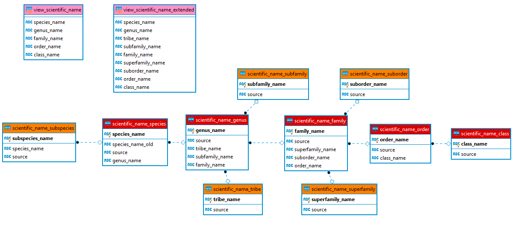
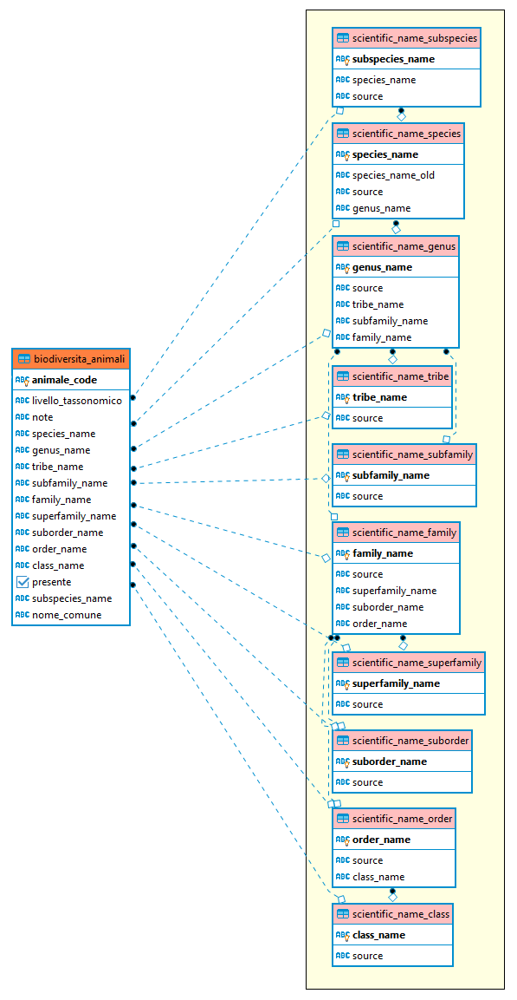
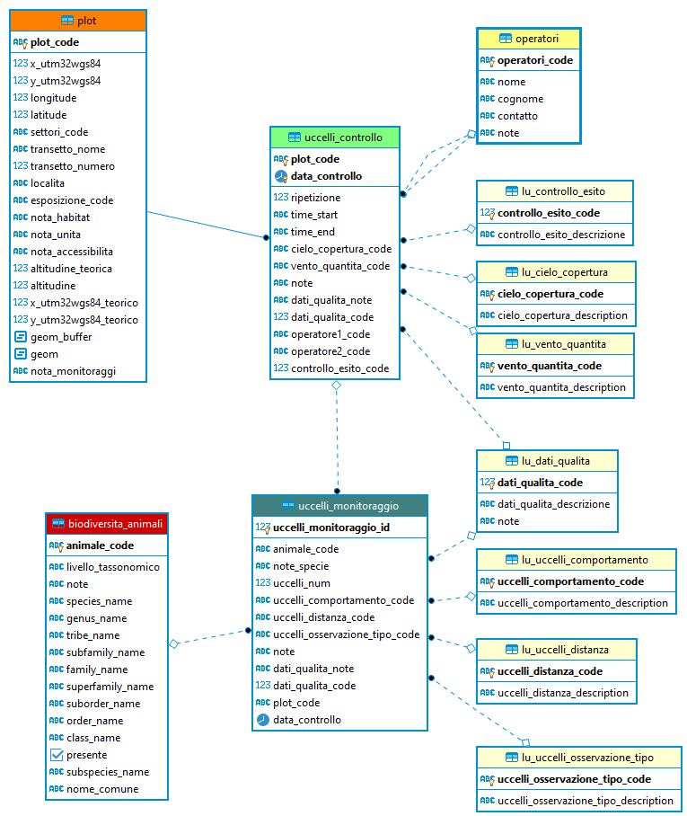
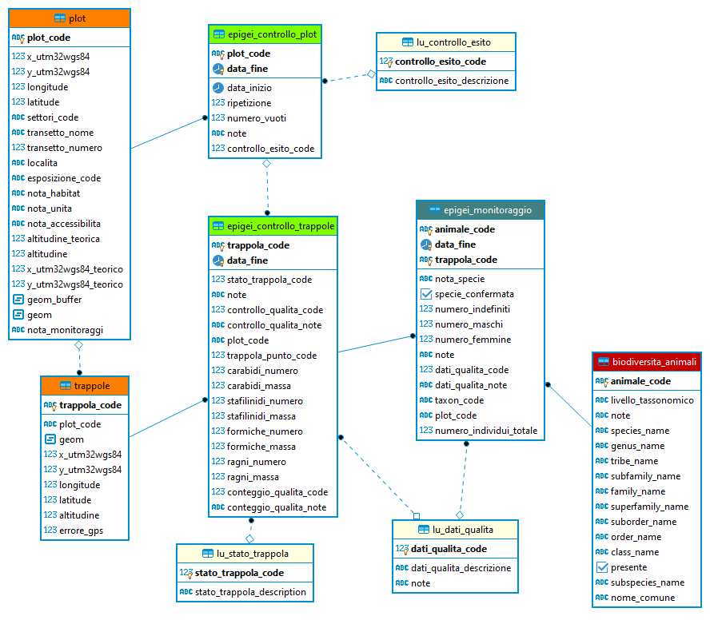
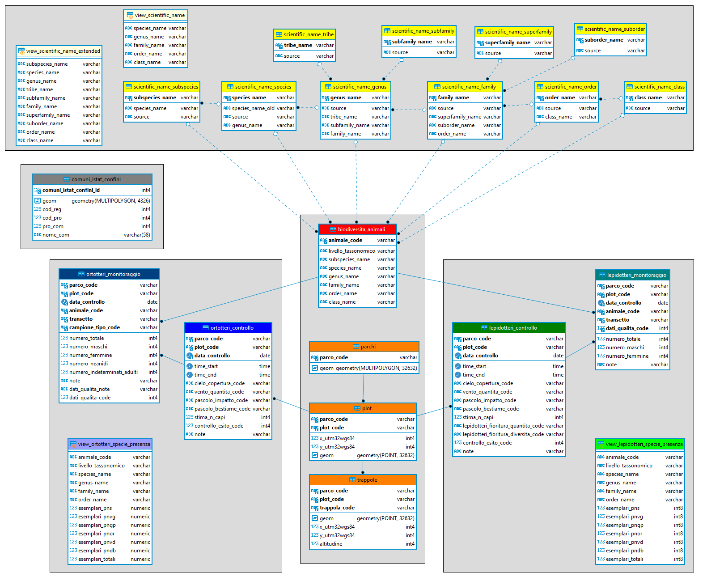

 

#### Lezione 4
## DATI DEL PROGETTO BIODIVERSITÀ

Autore: Ferdinando Urbano  

---

### Progetto Biodiversità
Nell'ambito di un progetto comune fra Parchi alpini italiani, dal 2013 vengono periodicamente e sistematicamente raccolti dati in plot definiti usando protocolli comuni. I principali taxa inclusi sono: ortotteri, lepidotteri, uccelli ed epigei (formiche, ragni, stafilinidi, carabidi).  
L'attività di creazione dei database dei Parchi, con l'obiettivo di creare repositori con tutte le informazioni raccolte negli anni, è partita inizialmente con lo scopo di archiviare i dati raccolti dai diversi Parchi in modo standardizzato in modo da poterli integrare facilmente.  
La struttura dei dati di biodiversità nei 4 database è ora largamente interoperabile, anche se alcune differenze permangono a causa, in alcuni casi, di una diversa interpretazione dei protocolli.  
Il lavoro fatto è stato principalmente di verifica della qualità dei dati e di correzione, integrazione e documentazione delle informazioni in collaborazione con gli esperti che hanno raccolto i dati sul campo.  
I dati di ogni Parco sono archiviati nel rispettivo database, ma è stato creato un database "virtuale" che prendere in modo dinamico i dati dai 4 database e li unisce tramite *tabelle esterne* (foreign tables) in delle *viste* (view) riassuntive. Questo database Biodiversità (ospitato sul server del Parco dello Stelvio) è accessibile a tutti i Parchi e si aggiorna automaticamente quando un nuovo record è inserito in uno qualsiasi dei parchi.  
La struttura delle tabelle creata nei singoli database garantisce in buona misura che i dati che verranno inseriti in futuro contengano un numero minimo di errori, che vengono evidenziati direttamente in fase di inserimento.  
I database dei Parchi costituiscono a questo punto il riferimento unico quanto alla versione valida dei dati. Qualsiasi modifica/miglioramento ai dati dovrebbe quindi essere fatto nel database, per evitare di generate potenziali versioni incoerenti.  
Per questo corso è stata fatta una copia semplificata delle tabelle condivise riassuntive di alcuni taxa del progetto Biodiversità (ortotteri, lepidotteri) in modo di avere dei dati da utilizzare per fare esempi ed esercizi nell'uso del database e del linguaggio SQL. Questi dati sono una "copia di lavoro" e non il riferimento ufficiale, che rimane il database condiviso.  
In questa lezione viene illustrato il modello dati delle informazioni archiviate nel database del corso in modo da spiegare come sono organizzati i dati Biodiversità e facilitare gli esercizi di interrogazione dei dati delle lezioni successive.  
I modelli dati sono riportati in questa pagina e verranno descritti e spiegati nel dettaglio durante la video lezione.

### Altri dati nei DB dei Parchi
Prima di spiegare i grafici Entità Relazioni (ER) del progetto Biodiversità, in questa sezioni vengono schematicamente riportati i data set che al momento (Marzo 2021) sono stati processati o sono in corso di elaborazione, nei database dei 4 Parchi.

#### Dati nel DB del Parco del Gran Paradiso  

* Biodiversità
* Osservazioni delle guardie
* Censimenti ungulati
* Stambecco
* Marmotta
* Lupo
* Fototrappole (in corso)
* Domestici (in corso)

#### Dati nel DB del Parco dello Stelvio

* Biodiversità
* Osservazioni
* Censimenti camoscio
* Censimenti capriolo
* Censimenti cervo
* Censimenti stambecchi
* Cervo controllo
* Monitoraggio marcati
* Ungulati dinamica
* Ungulati tracking
* Galliformi (in corso)

#### Dati nel DB del Parco della Val Grande
* Biodiversità (in corso)
* Chirotteri
* Galliformi (in corso)
* Mustelidi (in corso)
* Rapaci (in corso)
* Rosalia Alpina
* Ungulati (in corso)

#### Dati nel DB del Parco delle Dolomiti Bellunesi

* Biodiversità (in corso)

### Struttura dati generale  
Qui di seguito sono riportati i diagrammi con la struttura generale dei dati di biodiversità, illustrati in dettaglio nella videolezione. Maggiori dettagli sono disponibili nelle pagine di documentazione dei singoli parchi (vedere [https://github.com/feurbano/](https://github.com/feurbano/)).

#### Struttura dati tassonomia

Una nota particolare è necessaria su come sono organizzare le informazioni tassonomiche riferite ai singoli individui. Non sempre le determinazioni sono effettuate a livello di specie. In alcuni casi ci sono sottospecie, oppure solo genus, o famiglia o ordine. Inoltre, in alcuni casi (vedi uccelli, e per altri dataset dei parchi, le osservazioni occasionali) l'identificazione dell'animale è fatta con il nome comune e non con quello scientifico.  
Per avere un sistema flessibile ma rigoroso, si è deciso di creare una tabella chiamata *biodiversita_animali* dove viene utilizzato un campo *animale_code* che può essere qualsiasi identificativo (nome scientifico ai vari livelli tassonomici, nome comune). In quest tabella ogni identificativo viene poi "mappato" a tutti i livelli tassonomici. Attraverso questa tabella si può poi armonizzare secondo i nomi scientifici e interrogare i dati in relazione al livello tassonomico richiesto.  

  

  

#### Struttura monitoraggio

Schema generale per uccelli (analogo a quello degli ortotteri e lepidotteri).

  

Schema generale per gli epigei (il Parco dello Stelvio ha creato una tabella di monitoraggio unica per tutti gli epigei, mentre gli altri Parchi hanno tenuto distinti i 4 taxa)

  

### Struttura DB corso_parchi

Per il corso, è stato creato un database apposito prendendo alcuni degli elementi del database "ufficiale" condiviso. Questo è il modello dati complessivo.  

  

---
[**Lezione 5.**](https://github.com/feurbano/corsoparchi/blob/master/lezioni/lezione_05.md) Comandi SQL base - [<ins>[**Link pagina web**](https://feurbano.github.io/corsoparchi/lezioni/lezione_05.html)</ins>]
