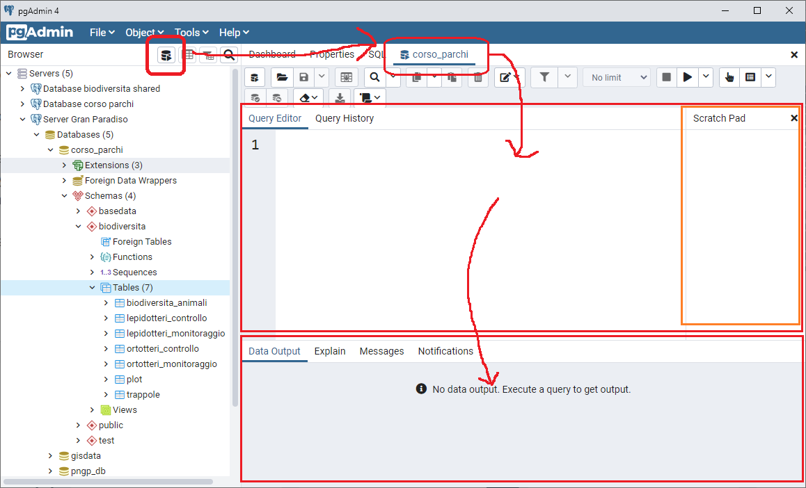
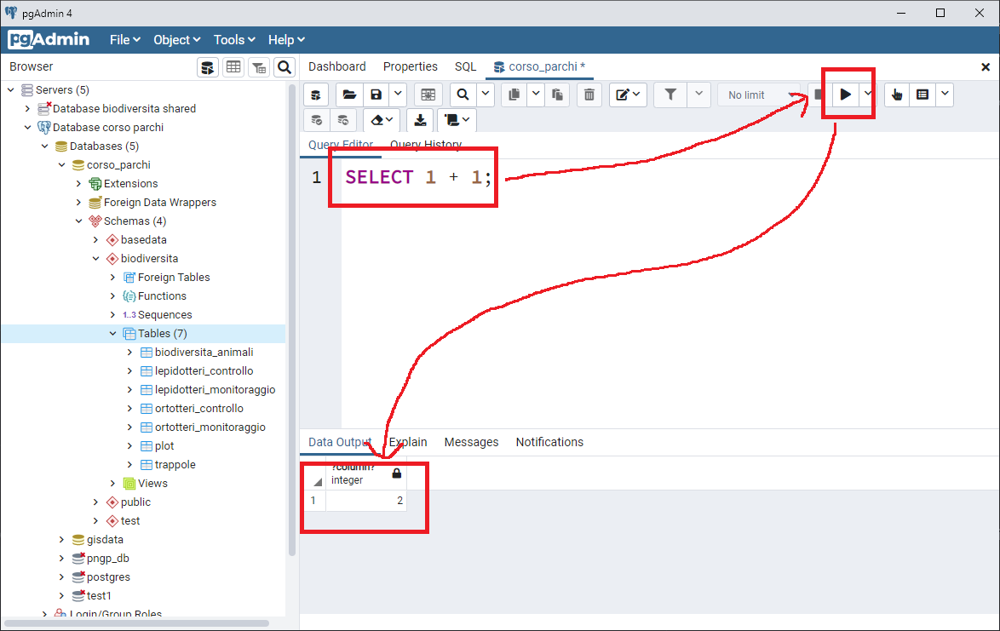
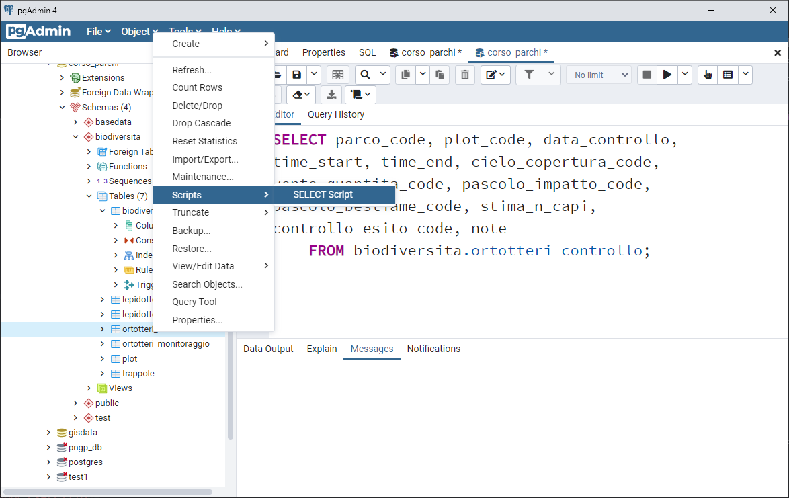
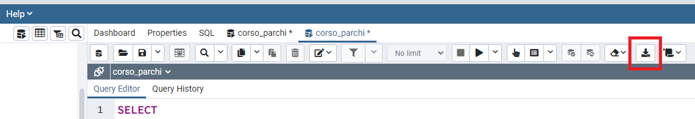

<p align="center"> </p>

#### Lezione 5
## INTRODUZIONE A SQL E COMANDI BASE
Autore: Ferdinando Urbano  

---

SQL, che sta per Structured Query Language, e il linguaggio che si utilizza per interagire (interrogare i dati, manipolare i dati, creare degli oggetti) con i database relazionali. SQL è un linguaggio standard, il che vuol dire che è (quasi) indipendente dal particolare database scelto (ad esempio PostgreSQL, Oracle, Microsoft SQL Server, Mysql). SQL, per quanto sia un linguaggio di programmazione e quindi richieda esperienza per essere usato al pieno delle sue potenzialità, è comunque un linguaggio di alto livello, quindi semplice almeno per quanto riguarda i comandi principali. Infatti, mentre le query (codice SQL finalizzato a chiedere dati al database nella forma richiesta dall'utente) complesse possono essere difficili da progettare, SQL combina un insieme molto limitato di comandi che sono in qualche modo vicini al linguaggio naturale.  
L'obiettivo delle prossime lezione è fornire i rudimenti per ottenere dal database i dati desiderati. Alcuni elementi più avanzati saranno solo di interesse per le persone che devono più direttamente essere coinvolte nell'uso e aggiornamento del database. In particolare, le lezioni 5 e 6 si concentrano sul recupero dei dati da un database esistente. In lezioni successive si vedrà come usare SQL per creare nuovi oggetti e per manipolare gli oggetti spaziali.

Il numero delle operazioni che si possono fare sul database aumenta esponenzialmente all'aumentare della conoscenza di SQL. Per gli utenti che desiderano sviluppare ulteriormente le proprie conoscenza in materia, esistono tantissimi tutorial gratuiti online. Ad esempio (tra i tanti):  

* [PostgreSQL official tutorial](https://www.postgresql.org/docs/current/static/tutorial.html)  
* [postgresqltutorial](http://www.postgresqltutorial.com/)  
* [w3resource](https://w3resource.com/PostgreSQL/tutorial.php)  
* [sqlbolt](https://sqlbolt.com/)  
* [webcheatsheet](http://webcheatsheet.com/sql/interactive_sql_tutorial/)  
* [www.sql.org](www.sql.org)  

Per una introduzione all'estensione spaziale PostGIS, una fonte di informazioni utile è:  

* [PostGIS Intro](https://postgis.net/workshops/postgis-intro/)  

In futuro, per l'uso e aggiornamento dei database dei singoli Parchi, gli operatori e i collaboratori potranno eventualmente chiedere il supporto tecnico al curatore e al gestore del database del proprio Parco.

### PgAdmin SQL editor
Per poter inviare una richiesta al database tramite una query SQL, si deve aprire la finestra SQL (o SQL editor) del client che si utilizza, nel nostro caso PgAdmin. L'icona del SQL editor è nella barra dei menù in alto a sinistra (vedi figura sotto). La finestra SQL verrà aggiunta alla lista delle schede (Le schede con gli SQL editor non vanno confuse con la scheda chiamata *SQL* che è utilizzata da PaAdmin per mostrare il codice SQL che genera l'oggetto selezionato nel menù ad albero del pannello di sinistra). Si possono aprire quante finestre SQL si vogliono, navigando poi fra le finestre come in qualsiasi pannello a schede. Ogni scheda può essere chiusa cliccando sul bottone (X) in alto a destra. Si sconsiglia di aprire troppe schede per non rendere la navigazione troppo complicata.  

[](https://github.com/feurbano/corsoparchi/blob/main/lezioni/materiale/l05_sql_editor.png?raw=true)  

L'editor è strutturato in due sezioni. In quella superiore si può scrivere il codice SQL, mentre in quella inferiore vengono visualizzati i risultati ottenuti dal database (cioè, i dati in formato tabellare). Nella sezione superiore, a destra può esserci una sottosezione *Scratch Pad*, la cui utilità è limitata e può essere chiuso per non prendere spazio all'editor SQL.  
Una volta aperta la finestra di SQL, è possibile cominciare ad interrogare il database per visualizzare i dati di interesse.

### SELECT, FROM
L'operazione di selezione dei record da visualizzare si chiama *selezione*: il comando `SELECT` vi permette di definire quali colonne (campi) vi servono, quali righe e in quale ordine. Si possono anche generare dati calcolati o derivati da dati esistenti. La struttura di base di un comando `SELECT` è la seguente:

```sql
SELECT
   <una o + colonne, o '*' per tutte le colonne di una tabella>
FROM
   <una o + tabelle>
WHERE
   <condizioni per filtrare i record>
;
```

Nei box neri/grigi di testo sono sempre incluse linee di codice.  
SQL è insensibile alle lettere minuscole/maiuscole. Le istruzioni SQL possono essere lunghe e estendersi su più righe (il carattere di ritorno riga è semplicemente ignorato). Per segnalare al database che una query finisce, bisogna terminarla con un punto e virgola `;`.

Il comando `SELECT` può essere usato anche da solo, senza altri comandi. Qui alcuni esempi. Per verificare il risultato, bisogna copiarli e incollarli nella finestra SQL. Per eseguire il comando SQL, bisogna usare il pulsante a forma di 'play':

[](https://github.com/feurbano/corsoparchi/blob/main/lezioni/materiale/l05_run.png?raw=true)  

Si possono eseguire operazioni matematiche:  
```sql
SELECT 1 + 1;
```

Si può manipolare del testo (in SQL una stringa di testo è sempre racchiusa dal simbolo di virgoletta singola `'`):  
```sql
SELECT 'Ciao a tutti';
```

Si può richiedere l'ora esatta:  
```sql
SELECT now();
```
Ogni tipo di dato ha poi associati una serie di operatori coerenti con la natura stessa del dato (ad esempio, operazioni algebriche per i numeri, o concatenazioni di stringhe per i caratteri).  
A volte PgAdmin può metterci molto ad eseguire il comando perché nel frattempo ha perso la connessione al server.

#### Esercizio
> Aprire un editor SQL ed eseguire tramite SELECT l'operazione 10 diviso 5 e visualizzare il risultato.

Il comando `FROM` specifica le tabelle in cui sono memorizzate le informazioni richieste. Se viene specificata una tabella, dopo `SELECT` bisogna elencare le colonne della tabella che si vogliono visualizzare (separate da una virgola). Se si usa `*`, vengono restituite tutte le colonne.  
In Postgres, una tabella viene identificata con `nome dello schema` + `.` + `nome della tabella` (di fatto, lo schema rappresenta una sorta di 'cognome' della tabella).  
Ad esempio, se si vogliono visualizzare i campi *parco_code* e *plot_code* della tabella plot contenuta nello schema *biodiversita* (vedi menu ad albero del pannello di sinistra) il codice SQL sarà il seguente:  
```sql
SELECT
  parco_code,
  plot_code
FROM
  biodiversita.plot;
```

Usando il simbolo '*' al posto del nome dei campi, vengono restituiti tutti campi di quella tabella:
```sql
SELECT
  *
FROM
  biodiversita.plot;
```

Un modo molto conveniente per preparare una query senza dover scrivere manualmente tutti i nomi dei campi di una tabella, è cliccare con il pulsante destro sulla tabella nel menu ad albero nel pannello di sinistra e selezionare l'opzione *Script/Select script* (vedi figura sotto).  
Un'altra funzionalità interessante dell'editor SQL è che se viene evidenziata una parte del testo, viene eseguita solo quella e ignorato il resto del codice nella finestra.

[](https://github.com/feurbano/corsoparchi/blob/main/lezioni/materiale/l05_script_select.png?raw=true)

#### Esercizio
> Aprire un nuovo editor SQL e creare il codice per visualizzare i campi parco_code, plot_code, data_controllo della tabella ortotteri_controllo nello schema biodiversita (biodiversita.ortotteri_controllo).

### WHERE, =
Il comando `WHERE` (in inglese, dove) è usato per impostare i criteri sui dati che volete recuperare e limitare il risultato alle sole informazioni di interesse.  
In questo esempio, vengono selezionate i campi *animale_code* e *numero_totale* dalla tabella *ortotteri_monitoraggio* (con le informazioni sulle determinazioni degli orotteri) dello schema *biodiversita*, limitando il risultato ai record in cui sono stati trovati 20 individui totali (l'uguaglianza si indica con l'operatore matematico `=` per tutti i tipi di dato inclusi numeri, testo, date):
```sql
SELECT
  animale_code,
  numero_totale
FROM
  biodiversita.ortotteri_monitoraggio
WHERE
  numero_totale = 20;
```

Un esempio di un criterio impostato su un campo testuale è il seguente, dove vengono richiesti tutti i record relativi alla specie Omocestus viridulus (il testo deve essere sempre incluso fra virgolette singole):
```sql
SELECT
  animale_code,
  numero_totale
FROM
  biodiversita.ortotteri_monitoraggio
WHERE
  animale_code = 'Omocestus viridulus';
```

Una descrizione completa di `SELECT` e dei comandi relativi è disponibile [qui](https://www.postgresql.org/docs/devel/static/sql-select.html).

#### Esercizio
> Visualizzare tutte le colonne della tabella biodiversita.ortotteri_controllo che hanno come valore del campo cielo_copertura_code la stringa di test 'parzialmente coperto'. Il simbolo '*' può aiutare a chiedere tutte le colone di una tabella in modo semplice e veloce.

### AND, OR
Si possono specificare criteri multipli nella clausola `WHERE` della query SQL combinandoli attraverso l'uso degli operatori logici `AND` e `OR`. Il primo fa si che i criteri debbano essere verificati entrambi per restituire un record, mentre nel secondo caso basta che sia realizzata una delle due condizioni.  
In questo esempio, vengono selezionati alcuni campi della tabella *biodiversita.ortotteri_controllo* dove nel plot ci sono più 20 ovini (usando `AND`):

```sql
SELECT
  parco_code,
  plot_code,
  data_controllo,
  pascolo_impatto_code,
  pascolo_bestiame_code,
  stima_n_capi
FROM
  biodiversita.ortotteri_controllo
where
  stima_n_capi = 20 AND
  pascolo_bestiame_code = 'ovini';
```

Il risultato è due record. Usando `or`  invece di `AND` basta che almeno uno dei criteri sia soddisfatto quindi vengono restituiti tutti i record con ovini o con 20 capi, anche di altri animali.

```sql
SELECT
  parco_code,
  plot_code,
  data_controllo,
  pascolo_impatto_code,
  pascolo_bestiame_code,
  stima_n_capi
FROM
  biodiversita.ortotteri_controllo
where
  stima_n_capi = 20 or
  pascolo_bestiame_code = 'ovini';
```

#### Esercizio
> Visualizzare tutte le colonne della tabella biodiversita.ortotteri_controllo che hanno come valore del campo cielo_copertura_code il campo 'parzialmente coperto' (come nell'esercizio precedente) ma che devono anche soddisfare il criterio di avere 'pascolo' come valore di pascolo_impatto_code.

### IN, NOT IN
Si possono specificare più valori accettabili per un dato campo. Invece che usare una lunga serie di comandi `OR` sullo stesso campo, per introdurre una lista si può usare il comando `IN` seguito dai valori separati da una virgola fra parentesi. Nel caso di testo, i valori devono ovviamente essere inclusi fra virgolette singole. `NOT IN` viene usato per specificare che i valori richiesti sono tutti ad esclusione quelli elencati fra parentesi.  
Nell'esempio sotto vengono selezionati tutti i plot dei Parchi Orsiera Rocciavrè e Alpe Veglia e Alpe Devero:

```sql
SELECT
  parco_code,
  plot_code,
  x_utm32wgs84,
  y_utm32wgs84,
  geom
FROM
  biodiversita.plot
WHERE
  parco_code in ('pnor','pndv');
```

#### Esercizio
> Selezionare tutti i record della tabella biodiversita.ortotteri_controllo che hanno come codice controllo_esito_code il valore 2 (controllo effettuato senza specie) o 3 (controllo non effettuato). I valori numerici non hanno bisogno di essere compresi fra virgolette singole quando vengono scritti.

### !=, >, <
Quando vengono impostate le condizioni di selezione con la clausola `where`, l'operatore `=` non è l'unico che si può usare. Gli operatori maggiore `>` e minore `<` possono essere applicati a quasi tutti i tipi di dati (numerici, testo, date). In SQL la condizione di diverso (non uguale) si può esprimere con `!=` o con `<>`.  
Ritornando all'esempio della tabella *biodiversita.ortotteri_controllo*, possiamo ora specificare che nel plot ci devono essere più di 20 capi e che non devono essere ovini:

```sql
SELECT
  parco_code,
  plot_code,
  data_controllo,
  pascolo_impatto_code,
  pascolo_bestiame_code,
  stima_n_capi
FROM
  biodiversita.ortotteri_controllo
where
  stima_n_capi > 20 AND
  pascolo_bestiame_code != 'ovini';
```

#### Esercizio
> Quanti sono nella tabella *biodiversita.ortotteri_controllo* i record che hanno meno di 30 capi e che NON fanno parte del Parco dell'Orsiera (codice parco_code 'pnor').

### NULL, IS NULL, IS NOT NULL
Il concetto di dato nullo (`NULL`) è molto importante nella gestione delle informazioni. In generale, corrisponde a "non si sa". Questo è fondamentalmente diverso dal valore 0 o dal fatto che non si verifichi un determinato evento. Ad esempio, se in un monitoraggio vedo 2 adulti di una specie e nessun piccolo, devo riportare 2 adulti e 0 piccoli e non lasciare il campo piccoli senza valore, perché questo vorrebbe dire che non so se c'erano dei piccoli o meno. Allo stesso modo, se devo indicare che un individuo adulto femmina non era assieme ad un piccolo in un campo della tabella sì/no (booleano), devo indicare "no". Lasciando il campo senza valore, vorrebbe dire che non si sa se la femmina era insieme a un piccolo.  
Il valore nullo si indica con un campo "vuoto", ma nelle query SQL viene indicato con `NULL` (senza virgolette, in quanto non è un testo ma una "parole chiave" del linguaggio).  
Per interrogare un campo richiedendo solo le righe con valore `NULL` si usa l'espressione `IS NULL`  
Nell'esempio, si interrogano i record della tabella *biodiversita.ortotteri_controllo* in cui il campo *pascolo_impatto_code* è nullo e il campo *pascolo_bestiame_code* non è nullo:

```sql
SELECT
  parco_code,
  plot_code,
  data_controllo,
  pascolo_impatto_code,
  pascolo_bestiame_code
FROM
  biodiversita.ortotteri_controllo
where
  pascolo_impatto_code IS NOT NULL AND
  pascolo_bestiame_code IS NULL;
```

#### Esercizio
> Verificare se ci sono record nella tabella *biodiversita.ortotteri_controllo* dove il campo *pascolo_bestiame_code* non è nullo e allo stesso tempo il campo *pascolo_impatto_code* ha il valore 'assente'. Se così fosse, ci sarebbe probabilmente un errore, visto che la presenza di bestiame presuppone che ci sia un impatto. Una query può anche dare come risultato 0 righe.

### Alias
Gli alias sono dei nomi alternativi che possono essere assegnati agli oggetti di una query durante la sua esecuzione, in particolare a tabelle o a campi (colonne). Un alias si può specificare usando il termine `AS`. As esempio:
```sql
SELECT
  parco_code AS nome_parco,
  plot_code,
  data_controllo
FROM
  biodiversita.ortotteri_controllo;
```

Assegnerà il nome *nome_parco* alla colonna *parco_code*. Lo stesso risultato si otterrà omettendo `AS` e specificando l'alias subito dopo il nome del campo o della tabella:
```sql
SELECT
  parco_code nome_parco,
  plot_code,
  data_controllo
FROM
  biodiversita.ortotteri_controllo;
```

Il nome della tabella e del campo cambieranno nell'output e nell'esecuzione della query, ma non cambieranno i loro valori nel database.  
Lo scopo principale degli alias di colonna è quello di rendere le intestazioni dell'output di una query più comprensibili.  

Allo stesso modo può essere usato un alias per il nome di una tabella. In questo caso gli alias vengono spesso usati per rendere più leggibili i nomi lunghi di tabelle e per semplificare il codice nelle operazioni di join (integrazione) di diverse tabelle, come si vedrà in una delle prossime lezioni.  

Una nota importante sul nome degli oggetti di un database, che vale anche per gli alias. Nei nomi di tabelle, campi, viste etc non sono previsti caratteri speciali, spazi e lettere maiuscole. Se si vuole usare un nome con queste caratteristiche (fortemente sconsigliato) è necessario circondarlo con doppi apici come questo: `"Nome con Spazi e Maiuscole!"`.

### ORDER BY, LIMIT
In una query, oltre a definire *quali* dati devono essere visualizzati, si può controllare anche *come* vengono visualizzati. In particolare, si può definire il criterio di ordinamento basato su uno o più campi (analogamente a quanto si può fare in un foglio di calcolo) usando `ORDER BY (colonna a) ASC/DESC, (colonna b) ASC/DESC ...`. ASC vuol dire ordine crescente (default), DESC invece ordine decrescente. `ORDER BY` deve essere inserito alla fine della query.

In questo esempio i record della tabella *biodiversita.ortotteri_controllo* relativi al parco 'pnvg' vengono ordinati per plot e per data:
```sql
SELECT
  parco_code,
  plot_code,
  data_controllo
FROM
  biodiversita.ortotteri_controllo
WHERE
  parco_code = 'pnvg'
ORDER BY plot_code, data_controllo;
```

Con `LIMIT` si può specificare di riportare solo un certo numero di record, il che è conveniente quando le tabelle hanno molti record e si vuole esplorare solo il contenuto di una tabella. Spesso è utile combinare `ORDER BY` e `LIMIT` per ottenere solo i record con i valori maggiori per un certo campo. `LIMIT` deve essere specificato come ultimo elmento della query. In questo esempio, i record della tabella *biodiversita.ortotteri_controllo* vengono ordinati per numero di capi di bestiame (*stima_n_capi*) in ordine decrescente e poi il risultato limitato a 10 record per vedere solo quelli con il maggior numero di animali:
```sql
SELECT
  parco_code,
  plot_code,
  data_controllo,
  stima_n_capi
FROM
  biodiversita.ortotteri_controllo
ORDER BY
  stima_n_capi DESC
LIMIT 10;
```

#### Esercizio
> Visualizzare (solo) i 5 record con più individui (*numero_totale*) della tabella *biodiversita.ortotteri_monitoraggio*.  

### DISTINCT
A volte si può essere interessati a verificare solo quali valori univoci appaiono in una determinata serie di campi, e non tutti i record. In questo caso è possibile usare il comando `DISTINCT` per eliminare i record con valori duplicati. Il comando `DISTINCT` deve essere specificato subito dopo il comando `SELECT`. Ad esempio, con questa query visualizzo solo le combinazioni di valori *pascolo_impatto_code* e *pascolo_bestiame_code* nella tabella *biodiversita.ortotteri_controllo*:

```sql
SELECT DISTINCT
  pascolo_impatto_code,
  pascolo_bestiame_code
FROM
  biodiversita.ortotteri_controllo
order by
  pascolo_impatto_code;
```

#### Esercizio
> Quante sono le specie riportate nella tabella *biodiversita.ortotteri_conteggio* (se viene visualizzato un record per specie, è sufficiente poi vedere il numero totale di righe).  

### Stringhe, numeri, booleani
Come già discusso in precedenza, ogni colonna di una database è caratterizzata da un tipo di dato che ne limita i possibili valori. Ad esempio, se un campo è definito come intero (`INTEGER`), non potrà avere valori come '>5'. Se si cerca di inserire questo valore, il database darà un errore e l'operazione verrà interrotta. A ogni tipo di dato è anche associato un determinato insieme di operazioni. Ad esempio non è possibile sommare due stringhe: `SELECT 'a' + 'b';`. Il database da un errore se si prova a inviare questa query. Allo stesso modo non è possibile concatenare (unire, operatore: `||`) due interi, perché questa è una operazione riservata alle stringhe di caratteri:  `SELECT 3 || 4;`.  
Le operazioni consentite sono la somma di numeri e concatenazione di testo, come in questo esempio (dove vengono usati alias per rendere il nome dei campi più comprensibile):
```sql
SELECT
  3 + 4 AS esempio_numeri,
  'a' || 'b' AS esempio_caratteri;
```

Il tipo di dato della colonne risultante è riportato sotto il suo nome nella tabella restituita dall'editor SQL (in questo caso, `INTEGER` e `TEXT`).  
Il database quando effettua una operazione fra due valori con un certo tipo di dati, calcolerà il risultato secondo lo stesso tipo di dato. In questo esempio si può vedere come il risultato della divisione di due interi è un intero (approssimato in caso di valori decimali), mentre vengono riportati i decimali se almeno uno dei numeri è espresso in formato decimale (`FLOAT` o `NUMERIC`):

```sql
SELECT
  10 / 4 AS divisione_interi,
  10 / 4.0 AS divisione_decimali;
```

Un ulteriore tipo di dati usato spesso è `BOOLEAN`, che può assumere 3 valori: TRUE, FALSE o NULL. Il database come valori per TRUE accetta anche `'t', 'true','y','yes','on','1'` e il corrispettivo per FALSE `'f','false','n','no','off','0'`, ma in tutti questi casi devono essere usate le virgolette (`FALSE` e `TRUE` come `NULL` non hanno bisogno di virgolette).

### CAST
Ci sono molti casi in cui si può voler convertire un tipo di dati in un altro. In PostgreSQL per compiere questa operazione è necessario usare `::` attaccato al nome di un campo seguito dal nuovo tipo di dati. Ovviamente non tutte le conversioni sono permesse. Ad esempio, un testo non può essere convertito in un numero, ma i numeri possono essere trasformati in testo, o un numero decimale in un intero, come in questo esempio (notate i tipi di dato nella tabella risultante):

```sql
SELECT
  7::text || 'a' AS numero2testo,
  7.8::integer AS numerico2intero;
```
### LIKE
PostgreSQL fornisce molti strumenti per fare ricerche nei campi con stringhe di caratteri. Oltre all'operatore di uguaglianza `=` usato per trovare stringhe uguali e quelli di maggiore `>` e minore `<` basati sull'ordine alfabetico, il comando più interessante è **[LIKE](https://www.postgresql.org/docs/devel/static/functions-matching.html)**. L'espressione `LIKE` restituisce TRUE se la stringa corrisponde al pattern fornito. Se il pattern non contiene segni di percentuale o underscore, allora il pattern rappresenta solo la stringa stessa; in questo caso LIKE agisce come l'operatore di uguaglianza. Un carattere di underscore `_` nel pattern sta per 'qualsiasi singolo carattere'; un segno di percentuale `%` corrisponde a una qualsiasi sequenza di caratteri.

In questo esempio, like specifica il nome di un animale da ricercare nella tabella *biodiversita.biodiversita_animali* senza usare caratteri speciali nel pattern e quindi di fatto corrisponde all'operatore `=`:
```sql
SELECT
  animale_code
FROM
  biodiversita.biodiversita_animali
WHERE
  animale_code like 'Amara aenea';
```

In questa query vengono cercati tutti i nomi che iniziano con 'Amara' e che hanno qualsiasi stringa dopo (quindi, di fatto tutte le specie del genere Amara):
```sql  
SELECT
  animale_code
FROM
  biodiversita.biodiversita_animali
WHERE
  animale_code like 'Amara%';
```

In questo caso, si specifica che dopo il termine 'Amara' deve esserci uno spazio e poi 5 caratteri qualsiasi (né più né meno):
```sql  
SELECT
  animale_code
FROM
  biodiversita.biodiversita_animali
WHERE
  animale_code like 'Amara _____';
```

In questo ultimo esempio ci cercano tutti i nomi che hanno la stringa 'erd' al loro interno:
```sql  
SELECT
  animale_code
FROM
  biodiversita.biodiversita_animali
WHERE
  animale_code like '%erd%';
```

#### Esercizio
> Cercare tutti i nomi di animali che terminano in 'x'.

### Scaricare i dati
Per scaricare la tabella che risulta da una query si possono usare i metodi già illustrati per una tabella. In più, nell'interfaccia PgAdmin del SQL Editor c'è una icona (vedi figura sotto) che permette di fare il download dei dati ina un file .csv.  

[](https://github.com/feurbano/corsoparchi/blob/main/lezioni/materiale/l05_sql_scaricare.png?raw=true)  

### Esercizi ricapitolativi

#### Esercizio 1
> Qual è il record della tabella *biodiversita.lepidotteri_monitoraggio* relativo al Parco dello Stelvio ('pns') con più individui (*numero_totale*)?

#### Esercizio 2
> Quanti sono i Parchi (*parco_code*) che hanno dati nella tabella *biodiversita.lepidotteri_monitoraggio*?

#### Esercizio 3
> Visualizzare i record della tabella *biodiversita.lepidotteri_monitoraggio* in ordine crescente di *data_controllo* che hanno più di 10 individui come numero totale.

#### Esercizio 4
> Nella tabella *biodiversita.lepidotteri_monitoraggio*, quali sono i record del Parco delle Dolomiti Bellunesi ('pndb') e del Parco del Gran Paradiso ('pngp') che hanno una nota (cioè in cui il campo *nota* è non nullo)?

#### Esercizio 5
> Nella tabella *biodiversita.lepidotteri_monitoraggio*, cercare tutti i record appartenenti al genere 'Pieris'.

---
[**Lezione 6.**](https://github.com/feurbano/corsoparchi/blob/master/lezioni/lezione_06.md) Comandi SQL per unire dati da tabelle diverse e per raggrupparli - [<ins>[**Link pagina web**](https://feurbano.github.io/corsoparchi/lezioni/lezione_06.html)</ins>]
